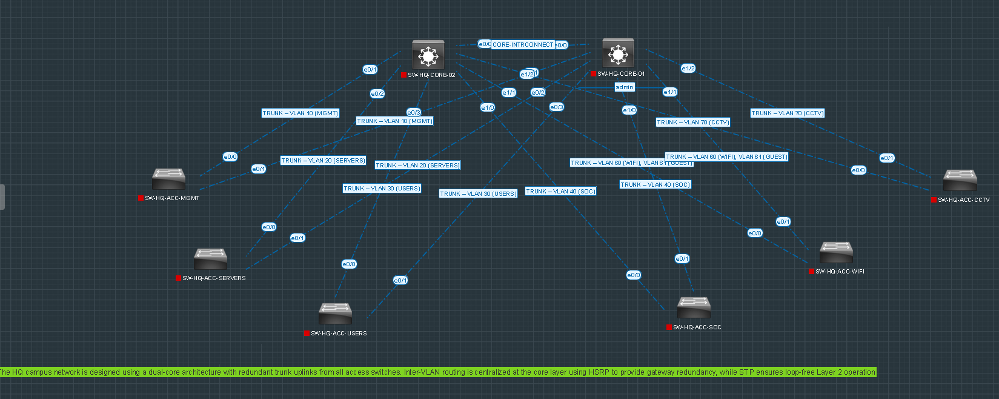
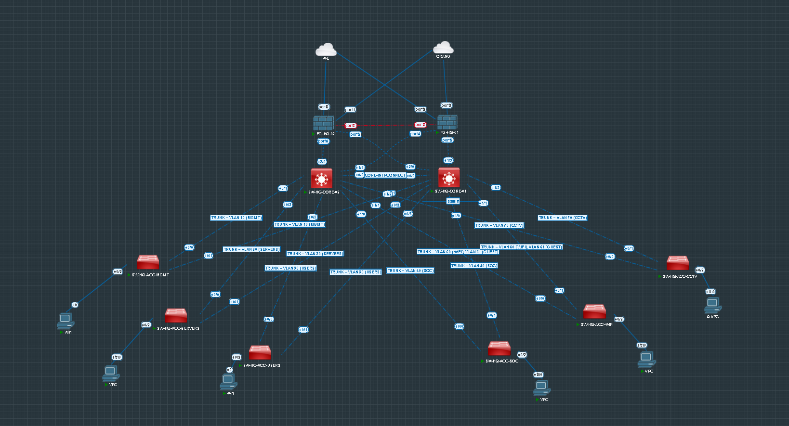
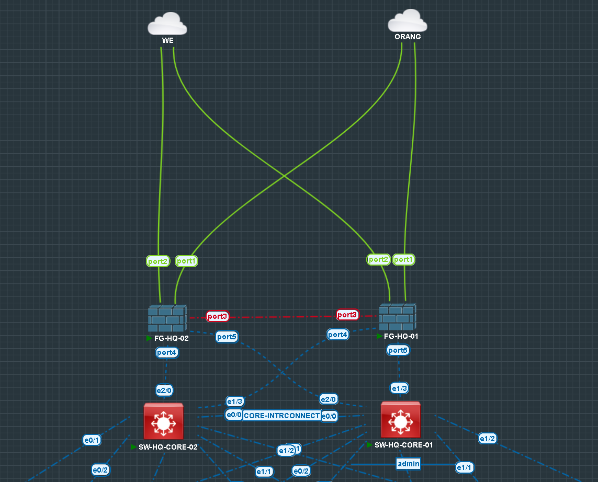
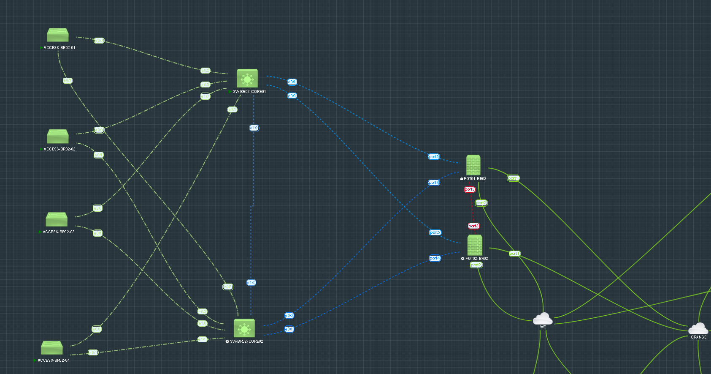
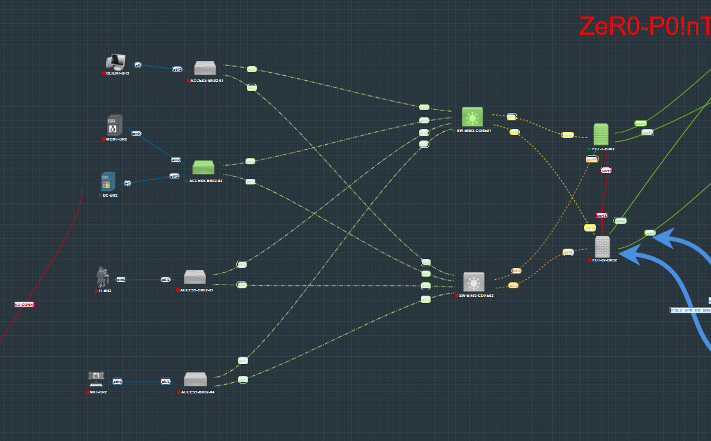

# 01 — Network Architecture

## Table of Contents

1. [High-Level Design](#high-level-design)
2. [Layered Architecture](#layered-architecture)
3. [Redundancy Strategy](#redundancy-strategy)
4. [Traffic Flow](#traffic-flow)
5. [Branch Connectivity](#branch-connectivity)

---

## 1. High-Level Design

The Zer0-Po!nT enterprise network is built on a **dual-core campus architecture** with centralized security enforcement at the perimeter.

### Key Design Decisions

| Decision | Rationale |
|----------|-----------|
| Dual Core Switches | Eliminates single point of failure at Layer 3 |
| HSRP on User VLANs | Provides seamless gateway failover |
| FortiGate HA Pair | Centralized security with automatic failover |
| Dual ISPs | Internet redundancy for business continuity |
| VLAN Segmentation | Logical isolation of traffic types |
| Transit VLANs (98, 99) | Clean separation between routing and security layers |

---

## 2. Layered Architecture

### Core Layer

- **Devices:** SW-HQ-CORE-01 (Active), SW-HQ-CORE-02 (Standby)
- **Function:** Layer 3 switching, Inter-VLAN routing, HSRP gateway redundancy
- **Protocol:** Rapid-PVST (STP Root Primary on CORE-01, Secondary on CORE-02)

### Access Layer

- **Devices:** Multiple access switches (ACC-MGMT, ACC-SERVERS, ACC-USERS, ACC-SOC, ACC-WIFI, ACC-CCTV)
- **Function:** Layer 2 operation, VLAN-based segmentation
- **Uplinks:** Dual-homed to both core switches via 802.1Q trunks

### Firewall Layer

- **Devices:** FortiGate HA Cluster (Active/Passive)
- **Function:** Perimeter security, SD-WAN, VPN termination, NAT
- **Interfaces:** WAN (WE, ORANGE), LAN Transit (port4, port5), HA Heartbeat (port3)

---

## 3. Redundancy Strategy

### Device Redundancy

| Layer | Primary | Backup | Failover Mechanism |
|-------|---------|--------|-------------------|
| Core | SW-HQ-CORE-01 | SW-HQ-CORE-02 | HSRP Priority 110 → 100 |
| Firewall | FG-HQ-01 | FG-HQ-02 | FortiGate HA (Active/Passive) |
| ISP | WE | ORANGE | SD-WAN with SLA monitoring |

### Link Redundancy

- Each access switch has **two uplinks** — one to each core
- Core interconnect link carries all VLANs via 802.1Q trunk
- Firewall has **two transit paths** (VLAN 99 via port5, VLAN 98 via port4)

---

## 4. Traffic Flow

### Internal Traffic (Inter-VLAN)

```
User (VLAN 30) → Access Switch → Core Switch → SVI Routing → Destination VLAN
```

> Internal traffic is routed at the core layer **without passing through the firewall**.

### Internet-Bound Traffic

```
User (VLAN 30) → HSRP Gateway (.1) → Core-01/02 → Transit VLAN 99/98 → FortiGate → SD-WAN → ISP
```

### Branch-to-HQ Traffic (VPN)

```
BR1 User → BR1 FortiGate → IPSec Tunnel → HQ FortiGate → HQ Core → HQ Destination
```

---

## 5. Branch Connectivity

### Branch-01 (BR1)

| VLAN | Name | Subnet | Gateway |
|------|------|--------|---------|
| 110 | BR1-CLIENT | 10.2.10.0/24 | 10.2.10.1 (FortiGate) |
| 120 | BR1-MGMT | 10.2.20.0/24 | 10.2.20.1 |
| 130 | BR1-IT | 10.2.30.0/24 | 10.2.30.1 |
| 140 | BR1-MKT | 10.2.40.0/24 | 10.2.40.1 |

### Branch-02 (BR2)

| VLAN | Name | Subnet | Gateway |
|------|------|--------|---------|
| 210 | BR2-CLIENT | 10.3.10.0/24 | 10.3.10.1 (FortiGate) |
| 220 | BR2-SERVERS | 10.3.20.0/24 | 10.3.20.1 |
| 230 | BR2-IT | 10.3.30.0/24 | 10.3.30.1 |
| 240 | BR2-MKT | 10.3.40.0/24 | 10.3.40.1 |
| 250 | BR2-MGMT | 10.3.50.0/24 | 10.3.50.1 |

> **Note:** In branches, the FortiGate performs **Inter-VLAN routing** (router-on-a-stick). Core switches operate at Layer 2 only.

---

## 6. Design Principles Summary

| Principle | Implementation |
|-----------|----------------|
| **High Availability** | Dual Core, Firewall HA, Dual ISP |
| **No Single Point of Failure** | Redundant links, devices, and paths |
| **Layered Design** | Core / Access / Firewall separation |
| **Centralized Routing** | Inter-VLAN at Core (HQ), at FortiGate (Branches) |
| **Secure Perimeter** | FortiGate with full security stack |
| **Scalability** | VLAN-based, modular, ready for new branches |

---

## Screenshots

Reference screenshots captured during the build, extracted from the original project log.


*HQ dual-core, dual-uplink topology — the starting design point for the project.*


*HQ topology as static-IP validation phase closes, ready for SD-WAN / SOC / AD / DNS / DHCP.*


*Layered flow: Users/Servers/WiFi/CCTV → Access → Core (HSRP) → FortiGate HA → ISPs.*


*Branch-02 topology at the start of the BR2 implementation phase.*


*BR1 topology at closure — FortiGate inter-VLAN routing, SD-WAN, redundant VPN, AD/LDAP/FSSO all in place.*
