# 03 — Core Layer

## Table of Contents

1. [Overview](#overview)
2. [Core Switch Roles](#core-switch-roles)
3. [HSRP Design](#hsrp-design)
4. [Spanning Tree](#spanning-tree)
5. [Transit VLANs](#transit-vlans)
6. [Configuration Files](#configuration-files)
7. [Verification Commands](#verification-commands)

---

## 1. Overview

The Core Layer is the **backbone** of the Zer0-Po!nT enterprise network. It provides:

- **Layer 3 switching** — Inter-VLAN routing for all internal traffic
- **Gateway redundancy** — HSRP ensures seamless failover
- **High availability** — Dual core switches with no single point of failure
- **Centralized routing** — All VLANs route through the core

---

## 2. Core Switch Roles

| Device | Role | STP Priority | HSRP Priority |
|--------|------|-------------|---------------|
| SW-HQ-CORE-01 | Active Core | Root Primary | 110 (Active) |
| SW-HQ-CORE-02 | Standby Core | Root Secondary | 100 (Standby) |

---

## 3. HSRP Design

### Why HSRP?

HSRP (Hot Standby Router Protocol) provides a **virtual default gateway** for all end devices. If the active core fails, the standby core takes over automatically — end devices never notice the failure.

### HSRP Configuration Pattern

```cisco
interface VlanX
 ip address 10.1.X.2 255.255.255.0    ! Core-01 = .2, Core-02 = .3
 standby X ip 10.1.X.1                 ! Virtual IP = .1
 standby X priority 110                ! Core-01 = 110, Core-02 = 100
 standby X preempt                      ! Reclaim role after recovery
 no shutdown
```

### HSRP Features Enabled

- **Preempt** — Active core reclaims gateway role after recovery
- **Priority-based failover** — Deterministic active/standby selection
- **Virtual IP (.1)** — Consistent default gateway for all clients

---

## 4. Spanning Tree

### Rapid-PVST Mode

```cisco
spanning-tree mode rapid-pvst
spanning-tree vlan 10,20,30,40,50,60,61,70 root primary   ! On CORE-01
spanning-tree vlan 10,20,30,40,50,60,61,70 root secondary  ! On CORE-02
```

### Design Rationale

- **Rapid-PVST** provides fast convergence (sub-second)
- **Core-01 as Root Primary** ensures optimal forwarding path
- **Core-02 as Root Secondary** provides instant failover
- **BPDU Guard** on access ports prevents rogue switches

---

## 5. Transit VLANs

### VLAN 99 — Core-01 ↔ FortiGate (port5)

| Parameter | Value |
|-----------|-------|
| Network | 10.1.99.0/24 |
| Core-01 SVI | 10.1.99.2 |
| FortiGate port5 | 10.1.99.1 |
| HSRP | ❌ Not used |

### VLAN 98 — Core-02 ↔ FortiGate (port4)

| Parameter | Value |
|-----------|-------|
| Network | 10.1.98.0/24 |
| Core-02 SVI | 10.1.98.2 |
| FortiGate port4 | 10.1.98.1 |
| HSRP | ❌ Not used |

> **Design Note:** Transit VLANs use **access ports** (not trunks) to the firewall to avoid subnet conflicts and ensure deterministic routing.

---

## 6. Configuration Files

| File | Description |
|------|-------------|
| [SW-HQ-CORE-01.txt](SW-HQ-CORE-01.txt) | Primary core — Active HSRP, STP Root Primary |
| [SW-HQ-CORE-02.txt](SW-HQ-CORE-02.txt) | Secondary core — Standby HSRP, STP Root Secondary |

---

## 7. Verification Commands

```bash
! Verify HSRP status
show standby brief

! Verify STP root status
show spanning-tree vlan 10 root

! Verify routing table
show ip route

! Verify interface status
show ip interface brief

! Verify VLAN database
show vlan brief

! Verify trunk status
show interfaces trunk

! Test connectivity to firewall
ping 10.1.99.1   ! From CORE-01
ping 10.1.98.1   ! From CORE-02
```

---

## Screenshots

Reference screenshots captured during the build, extracted from the original project log.

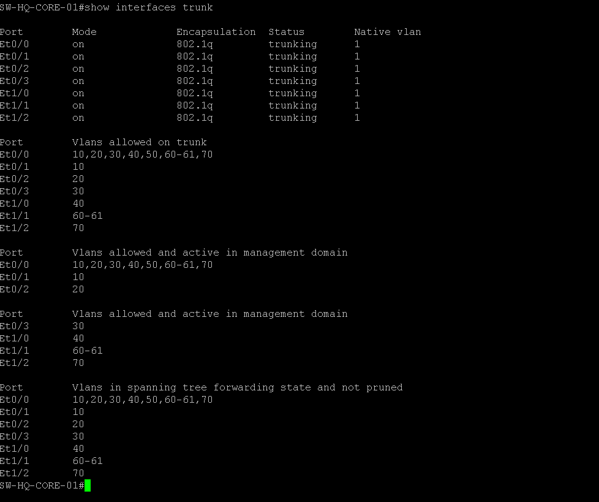
*SW-HQ-CORE-01 post-config verification (VLANs/HSRP).*

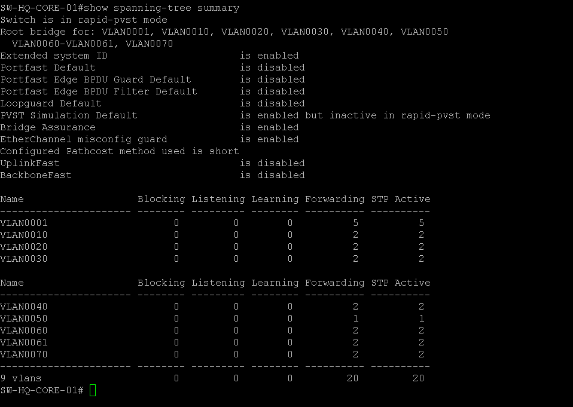
*SW-HQ-CORE-01 post-config verification.*

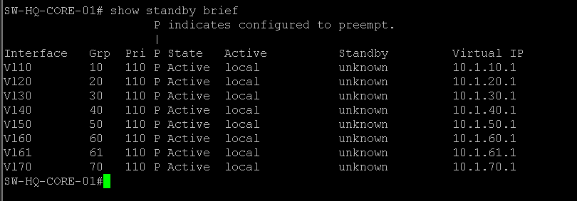
*SW-HQ-CORE-01 post-config verification.*

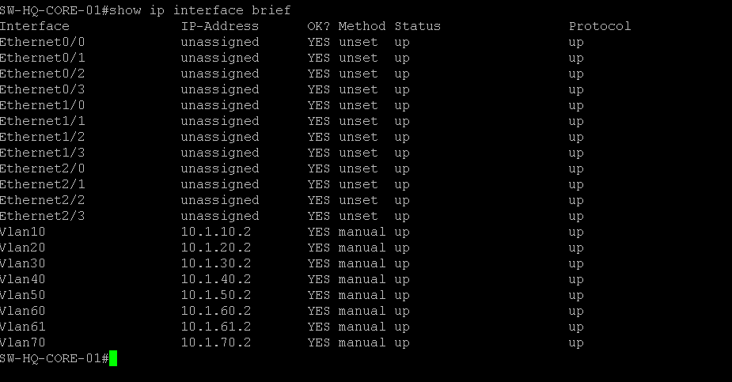
*SW-HQ-CORE-01 configured as active Layer-3 HSRP gateway for all VLANs.*

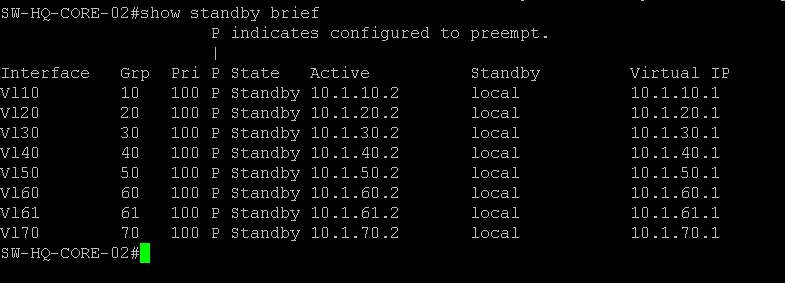
*SW-HQ-CORE-02 post-config verification (STP root secondary).*

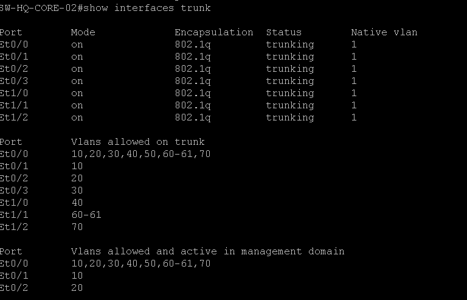
*SW-HQ-CORE-02 post-config verification.*

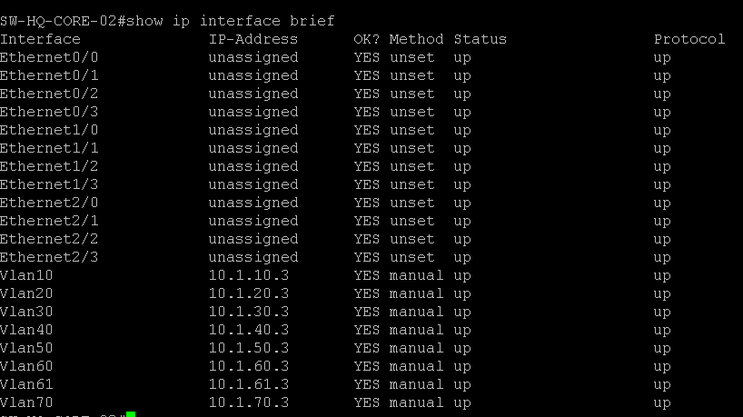
*SW-HQ-CORE-02 post-config verification.*

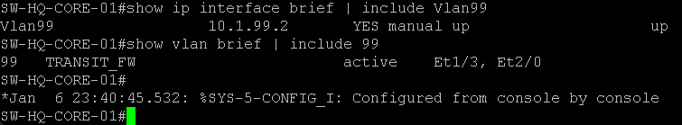
*Core-01 transit VLAN 99 (e1/3 & e2/0 to FortiGate port5).*

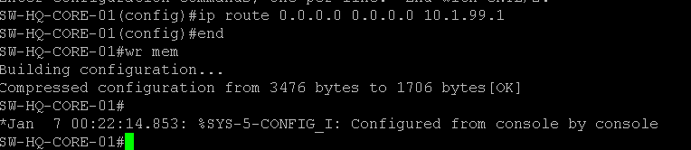
*Core-01 default route toward FortiGate via VLAN 99 (10.1.99.1).*

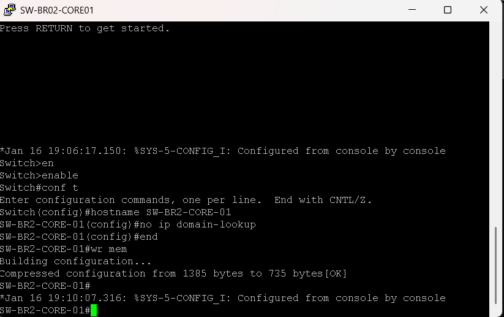
*SW-BR2-CORE-01 hostname/base config applied.*

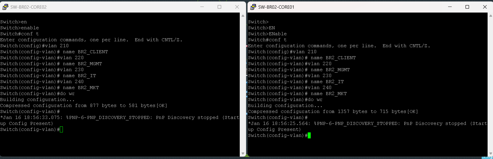
*BR2 core VLAN database (210/220/230/240) created — shared step for both cores.*

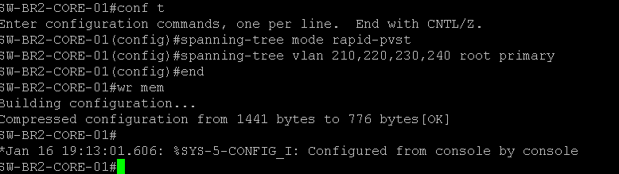
*SW-BR2-CORE-01 set as STP root primary for branch VLANs.*

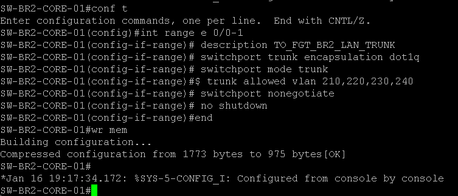
*SW-BR2-CORE-01 trunk uplink to the FortiGate cluster.*

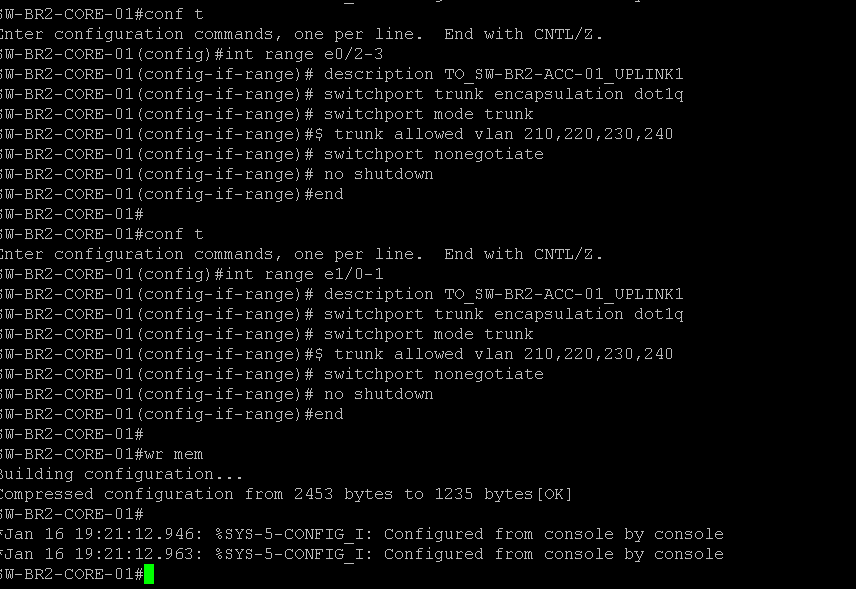
*SW-BR2-CORE-01 trunk uplinks to the access switch.*

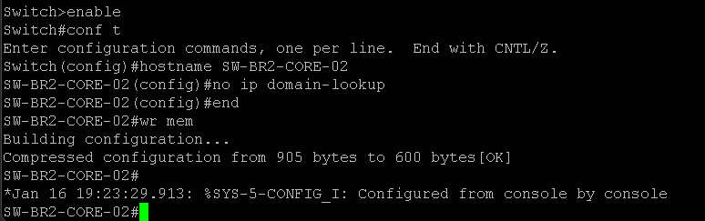
*SW-BR2-CORE-02 hostname/base config applied.*

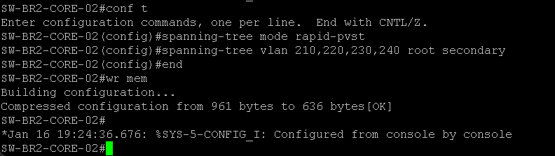
*SW-BR2-CORE-02 set as STP root secondary.*

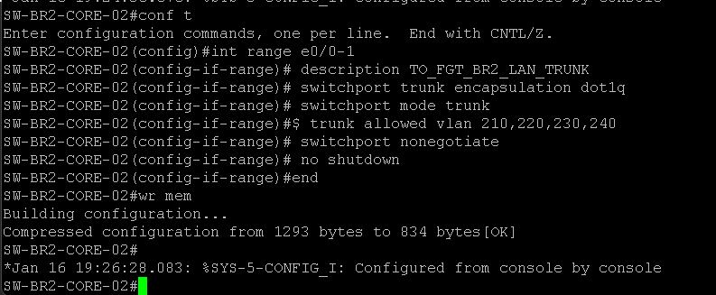
*SW-BR2-CORE-02 trunk uplink to the FortiGate cluster.*

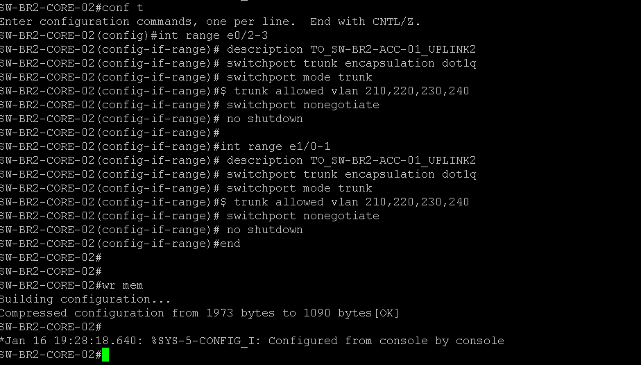
*SW-BR2-CORE-02 trunk uplinks to the access switch.*

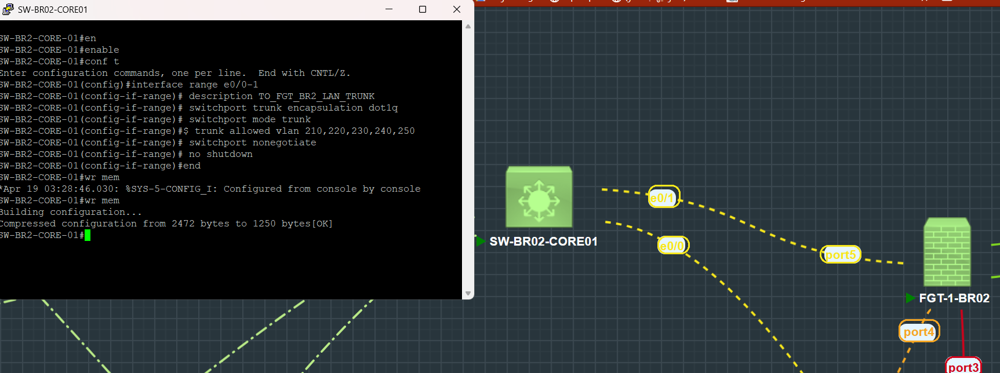
*Trunk uplinks between BR2 core switches and the FortiGate cluster — Core-01 side.*

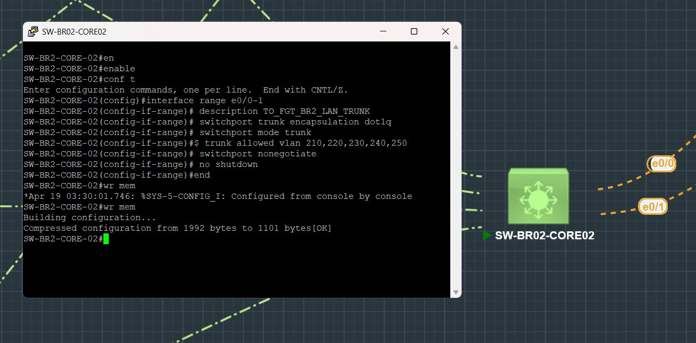
*Trunk uplinks between BR2 core switches and the FortiGate cluster — Core-02 side.*
