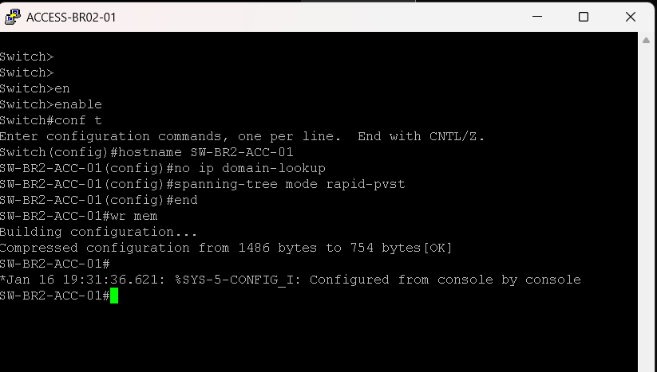
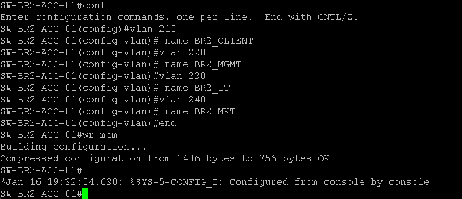
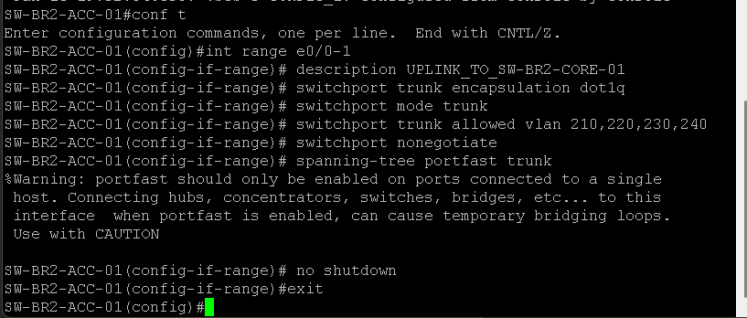
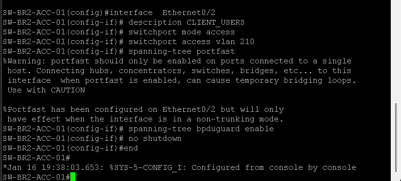
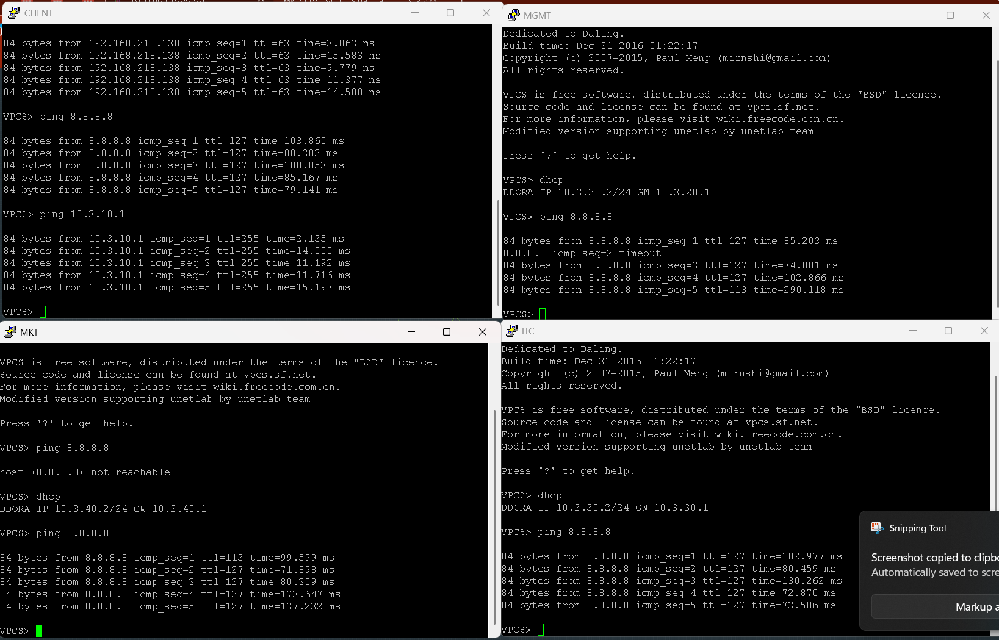
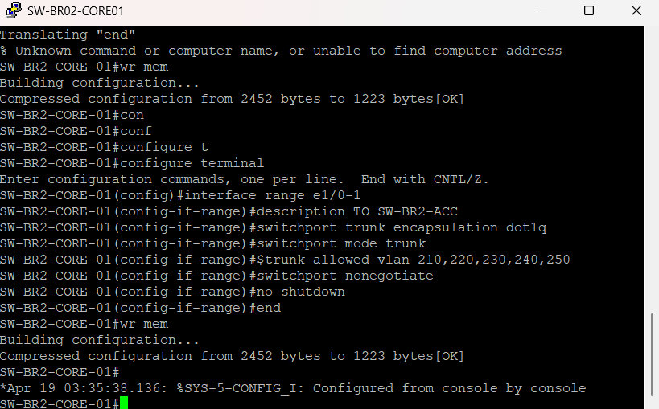
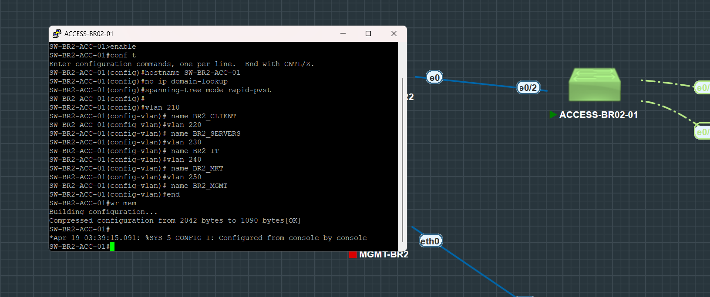
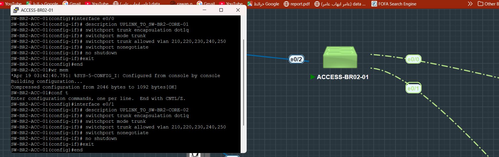
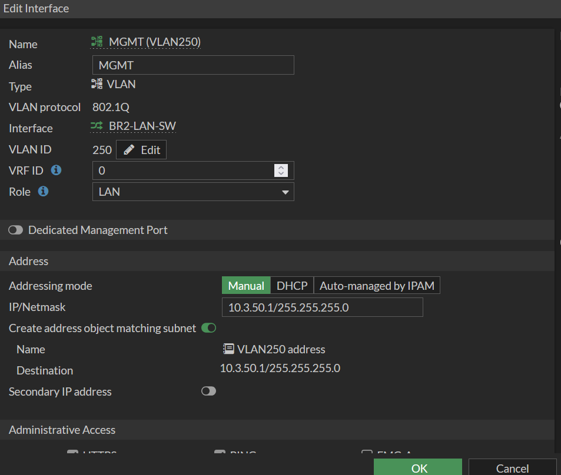
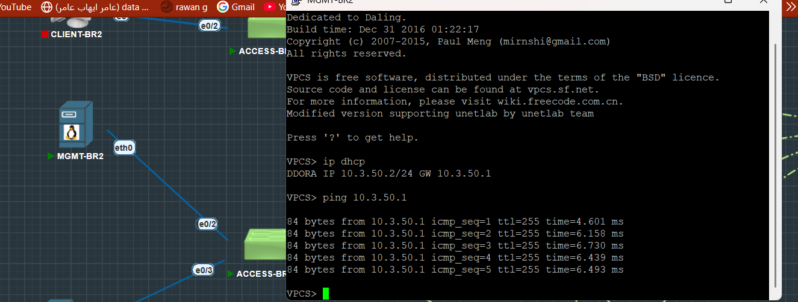

# 04 — Access Layer

## Table of Contents

1. [Overview](#1-overview)
2. [Design Principles](#2-design-principles)
3. [Security Hardening](#3-security-hardening)
4. [Configuration Files](#4-configuration-files)
5. [Port Security](#5-port-security)
6. [Verification Commands](#6-verification-commands)
---

## 1. Overview

The Access Layer connects **end devices** to the network. All access switches are:

- **Dual-homed** to both core switches for redundancy
- **Layer 2 only** — no routing at the access layer
- **VLAN-based** — each switch carries a specific set of VLANs

---

## 2. Design Principles

| Principle | Implementation |
|-----------|----------------|
| Redundancy | Two uplinks (one to each core) |
| Security | BPDU Guard, PortFast, Storm Control |
| Simplicity | Layer 2 operation only |
| Scalability | Template-based configuration |

---

## 3. Security Hardening

### PortFast

```cisco
spanning-tree portfast
```

- Immediately transitions access ports to forwarding state
- Safe for end-device connections only

### BPDU Guard

```cisco
spanning-tree bpduguard enable
```

- **Shuts down the port** if a BPDU is received
- Prevents rogue switches from creating loops
- Protects against topology manipulation attacks

### Storm Control

```cisco
storm-control broadcast level 5.00
storm-control multicast level 5.00
storm-control action shutdown
```

- Limits broadcast/multicast traffic to 5% of bandwidth
- Prevents broadcast storms from affecting network stability

---

## 4. Configuration Files

| File | Description | VLAN |
|------|-------------|------|
| [access-switch-template.txt](access-switch-template.txt) | Generic template for any access switch | Variable |
| [SW-HQ-ACC-MGMT.txt](SW-HQ-ACC-MGMT.txt) | Management devices switch | VLAN 10 |
| [SW-HQ-ACC-USERS.txt](SW-HQ-ACC-USERS.txt) | User workstations switch | VLAN 30 |
| [SW-HQ-ACC-SOC.txt](SW-HQ-ACC-SOC.txt) | SOC infrastructure switch | VLAN 40 |

> Additional access switches (ACC-SERVERS, ACC-WIFI, ACC-CCTV) follow the same template pattern.

---

## 5. Port Security

### Access Port Standard Configuration

```cisco
interface range Ethernet0/2 - 0/23
 switchport mode access
 switchport access vlan X
 spanning-tree portfast
 spanning-tree bpduguard enable
 storm-control broadcast level 5.00
 storm-control multicast level 5.00
 storm-control action shutdown
 no shutdown
```

### Uplink Port Standard Configuration

```cisco
interface Ethernet0/0
 description UPLINK-to-CORE-01
 switchport trunk encapsulation dot1q
 switchport mode trunk
 switchport trunk allowed vlan X
 spanning-tree portfast trunk
 no shutdown
```

---

## 6. Verification Commands

```bash
! Verify VLAN status
show vlan brief

! Verify trunk status
show interfaces trunk

! Verify port security
show spanning-tree interface Ethernet0/2 detail

! Verify BPDU Guard
show spanning-tree summary

! Verify storm control
show storm-control

! Test connectivity
ping 10.1.X.1   ! Gateway IP for the VLAN
```

---

## Screenshots

Reference screenshots captured during the build, extracted from the original project log.


*SW-BR2-ACC-01 hostname and base spanning-tree config.*


*SW-BR2-ACC-01 VLAN database aligned with the BR2 core design.*


*SW-BR2-ACC-01 dual trunk uplinks to Core-01 and Core-02.*


*SW-BR2-ACC-01 access port (VLAN 210) with PortFast + BPDU Guard.*


*BR2 access layer connectivity testing after port hardening.*


*Each BR2 access switch dual-homed to both core switches via 802.1Q trunks.*


*BR2 access switch VLAN database aligned with the core design.*


*Dual uplinks configured on the BR2 access layer for resilient forwarding.*


*BR2 access interfaces assigned by department/infrastructure role with PortFast + BPDU Guard.*


*BR2 access interfaces assigned by department/infrastructure role with PortFast + BPDU Guard.*
