# 05 — Firewall Architecture (FortiGate)

## Table of Contents

1. [Overview](#1-overview)
2. [HQ FortiGate](#2-hq-fortigate)
3. [BR1 FortiGate](#3-br1-fortigate)
4. [BR2 FortiGate](#4-br2-fortigate)
5. [High Availability](#5-high-availability)
6. [Verification Commands](#6-verification-commands)
---

## 1. Overview

The FortiGate firewall clusters serve as the **security perimeter** and **WAN edge** for all Zer0-Po!nT sites.

### Key Functions

- **Perimeter security** — All internet traffic passes through the firewall
- **NAT** — Hide internal networks behind public IPs
- **SD-WAN** — Intelligent path selection across dual ISPs
- **VPN termination** — Site-to-site IPSec tunnels between sites
- **Security profiles** — AV, Web Filter, IPS, App Control, SSL Inspection
- **Identity integration** — LDAP/FSSO with Active Directory
- **Inter-VLAN routing** — Router-on-a-stick for branch VLANs

---

## 2. HQ FortiGate

### Interface Assignment

| Port | Alias | IP | Role | Purpose |
|------|-------|-----|------|---------|
| port1 | WAN_ORANGE | DHCP | WAN | ISP-ORANGE connection |
| port2 | WAN_WE | DHCP | WAN | ISP-WE connection |
| port3 | HA_HEARTBEAT | 169.254.1.1/24 | Undefined | HA synchronization |
| port4 | CORE-TRANSIT-BACKUP | 10.1.98.1/24 | LAN | Backup transit to CORE-02 |
| port5 | CORE-TRANSIT-PRIMARY | 10.1.99.1/24 | LAN | Primary transit to CORE-01 |

### Configuration Files

| File | Description |
|------|-------------|
| [FGT-HQ-interfaces.txt](FGT-HQ-interfaces.txt) | Interface IP and role configuration |
| [FGT-HQ-static-routes.txt](FGT-HQ-static-routes.txt) | Static routes to LAN and default |
| [FGT-HQ-link-monitor.txt](FGT-HQ-link-monitor.txt) | Core reachability monitoring |
| [FGT-HQ-sdwan.txt](FGT-HQ-sdwan.txt) | SD-WAN member and health check config |
| [FGT-HQ-ha.txt](FGT-HQ-ha.txt) | High Availability cluster settings |
| [FGT-HQ-policy-internet.txt](FGT-HQ-policy-internet.txt) | Internet access policy with security profiles |

> **Design note:** The FortiGate license used for this project caps the total number of firewall policies. Rather than splitting HQ internet access into multiple role-based rules (as BR1/BR2 do with strict/standard/premium tiers), HQ relies on **one consolidated `LAN_to_Internet` policy** carrying the full security-profile stack (AV, Web Filter, App Control, IPS, SSL Inspection, DNS Filter, File Filter). This turns a single rule into a centralized enforcement point. See [11-Security-Profiles](../11-Security-Profiles/README.md#11-design-note--consolidated-hq-policy) for details.

---

## 3. BR1 FortiGate

### Interface Assignment

| Port | Alias | IP | Role | Purpose |
|------|-------|-----|------|---------|
| port1 | LAN_TRUNK | — | LAN | Trunk to BR1 core switches |
| port4 | WAN_ORANGE | DHCP | WAN | ISP-ORANGE connection |
| port5 | WAN_WE | DHCP | WAN | ISP-WE connection |
| port3 | HA_HB | 169.254.2.1/24 | Undefined | HA heartbeat |

### VLAN Interfaces (on Software Switch)

| Interface | VLAN | IP | Purpose |
|-----------|------|-----|---------|
| VLAN110_BR1_CLIENT | 110 | 10.2.10.1/24 | Client users |
| VLAN120_BR1_MGMT | 120 | 10.2.20.1/24 | Management |
| VLAN130_BR1_IT | 130 | 10.2.30.1/24 | IT department |
| VLAN140_BR1_MKT | 140 | 10.2.40.1/24 | Marketing |

### Configuration Files

| File | Description |
|------|-------------|
| [FGT-BR1-interfaces.txt](FGT-BR1-interfaces.txt) | Interfaces, software switch, VLANs |
| [FGT-BR1-dhcp.txt](FGT-BR1-dhcp.txt) | DHCP servers for all VLANs |
| [FGT-BR1-sdwan.txt](FGT-BR1-sdwan.txt) | SD-WAN configuration |
| [FGT-BR1-ha.txt](FGT-BR1-ha.txt) | HA cluster settings |
| [FGT-BR1-vpn.txt](FGT-BR1-vpn.txt) | IPSec VPN to HQ |
| [FGT-BR1-policies.txt](FGT-BR1-policies.txt) | Firewall policies (internet + VPN) |
| [FGT-BR1-ldap-fsso.txt](FGT-BR1-ldap-fsso.txt) | LDAP and FSSO integration |

---

## 4. BR2 FortiGate

### Interface Assignment

| Port | Alias | IP | Role | Purpose |
|------|-------|-----|------|---------|
| port1 | LAN_TRUNK | — | LAN | Trunk to BR2 core switches |
| port4 | WAN_ORANGE | DHCP | WAN | ISP-ORANGE connection |
| port5 | WAN_WE | DHCP | WAN | ISP-WE connection |
| port3 | HA_HB | 169.254.3.1/24 | Undefined | HA heartbeat |

### VLAN Interfaces (on Software Switch)

| Interface | VLAN | IP | Purpose |
|-----------|------|-----|---------|
| BR2-VLAN210-CLIENT | 210 | 10.3.10.1/24 | Client users |
| BR2-VLAN220-SERVERS | 220 | 10.3.20.1/24 | Servers |
| BR2-VLAN230-IT | 230 | 10.3.30.1/24 | IT department |
| BR2-VLAN240-MKT | 240 | 10.3.40.1/24 | Marketing |
| BR2-VLAN250-MGMT | 250 | 10.3.50.1/24 | Management |

### Configuration Files

| File | Description |
|------|-------------|
| [FGT-BR2-interfaces.txt](FGT-BR2-interfaces.txt) | Interfaces, software switch, VLANs |
| [FGT-BR2-dhcp.txt](FGT-BR2-dhcp.txt) | DHCP servers for all VLANs |
| [FGT-BR2-sdwan.txt](FGT-BR2-sdwan.txt) | SD-WAN configuration |
| [FGT-BR2-ha.txt](FGT-BR2-ha.txt) | HA cluster settings |
| [FGT-BR2-vpn.txt](FGT-BR2-vpn.txt) | IPSec VPN to HQ |
| [FGT-BR2-policies.txt](FGT-BR2-policies.txt) | Firewall policies (internet + VPN) |
| [FGT-BR2-ldap-fsso.txt](FGT-BR2-ldap-fsso.txt) | LDAP and FSSO integration |

---

## 5. High Availability

### FortiGate HA (Active/Passive)

| Site | Group Name | Primary Priority | Heartbeat | Monitored Interfaces |
|------|-----------|-----------------|-----------|---------------------|
| HQ | HQ-FGT-HA | 200 | port3 | port1, port2, port4, port5 |
| BR1 | BR1-FGT-HA | 200 | port3 | WAN_ORANGE, WAN_WE, BR1-LAN-SW |
| BR2 | BR2-FGT-HA | 200 | port3 | WAN_ORANGE, WAN_WE, BR2-LAN-SW |

### Failover Behavior

1. If the active FortiGate fails → Passive takes over automatically
2. Floating IPs move to the new active unit
3. Configuration syncs automatically via HA heartbeat

---

## 6. Verification Commands

```bash
! Verify interface status
get system interface physical

! Verify routing table
get router info routing-table all

! Verify HA status
get system ha status

! Verify SD-WAN members
get system sdwan

! Verify VPN tunnels
diagnose vpn tunnel list

! Verify link monitors
get system link-monitor status

! Test connectivity
execute ping 10.1.99.2
execute ping 10.1.98.2
execute ping 8.8.8.8

! Verify LDAP
diagnose test connect <dc-ip> 389

! Verify FSSO
diagnose debug fsso server-status
```

---

## Screenshots

Reference screenshots captured during the build, extracted from the original project log.

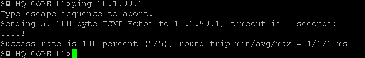
*FortiGate LAN summary static route (10.1.0.0/16) — primary/backup via port5/port4.*

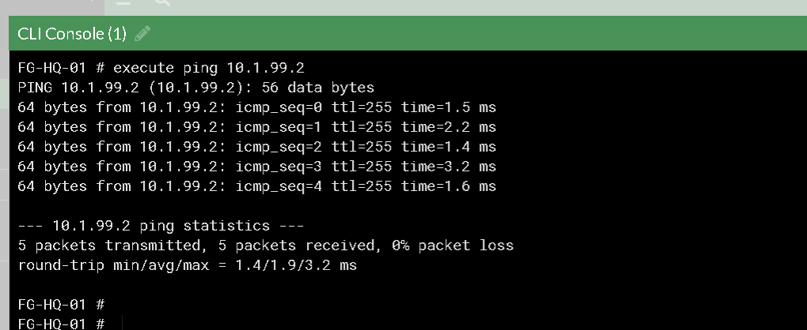
*FortiGate LAN summary static route detail.*

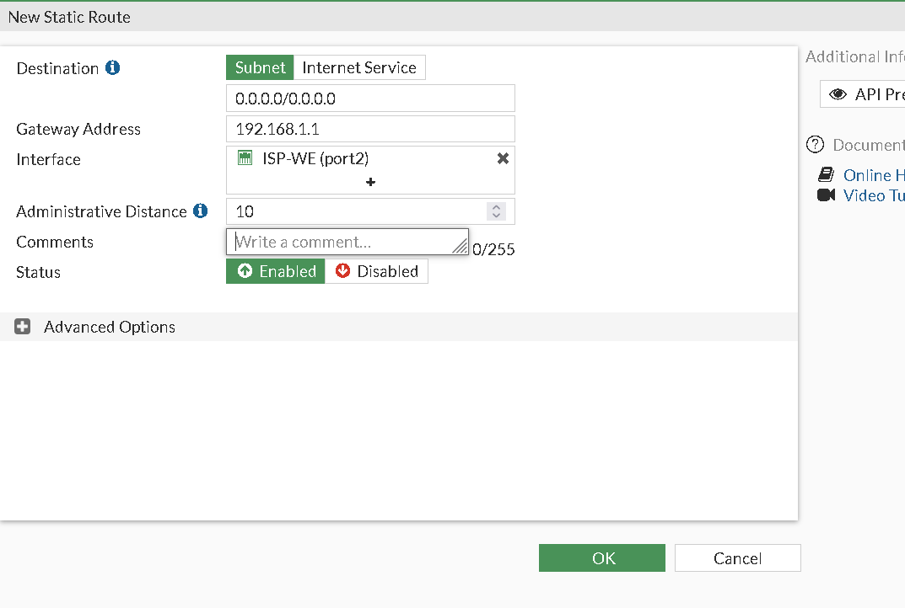
*Initial FortiGate static route test — VLAN 30 client reaching Google.*

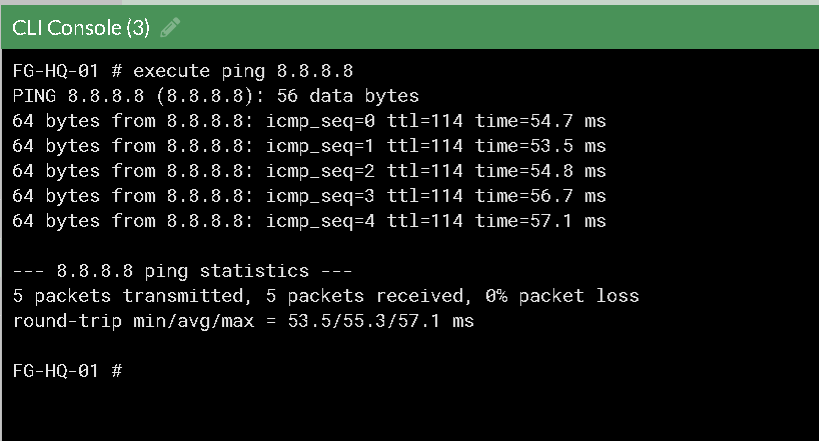
*Initial static routing test result.*

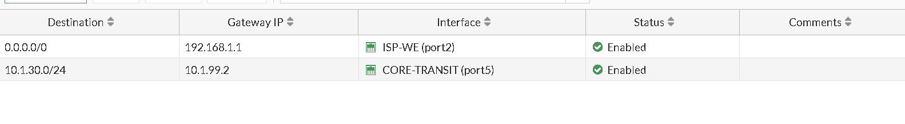
*Static routing implemented per specific VLAN.*

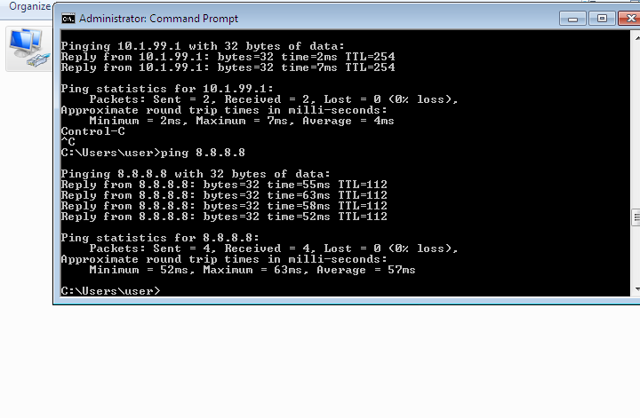
*Static routing per VLAN — additional verification.*

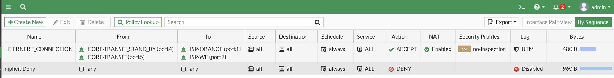
*Static routing per VLAN — additional verification.*

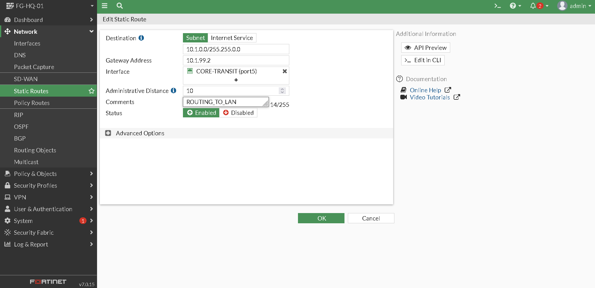
*Summarized static routing to all VLANs on the firewall (scalability improvement).*

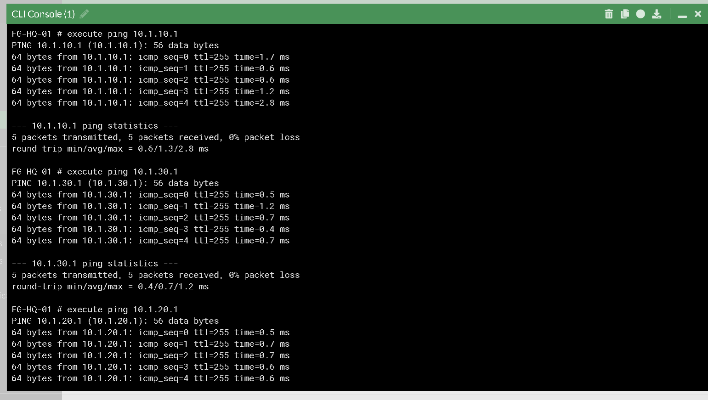
*Summarized static routing — additional verification.*

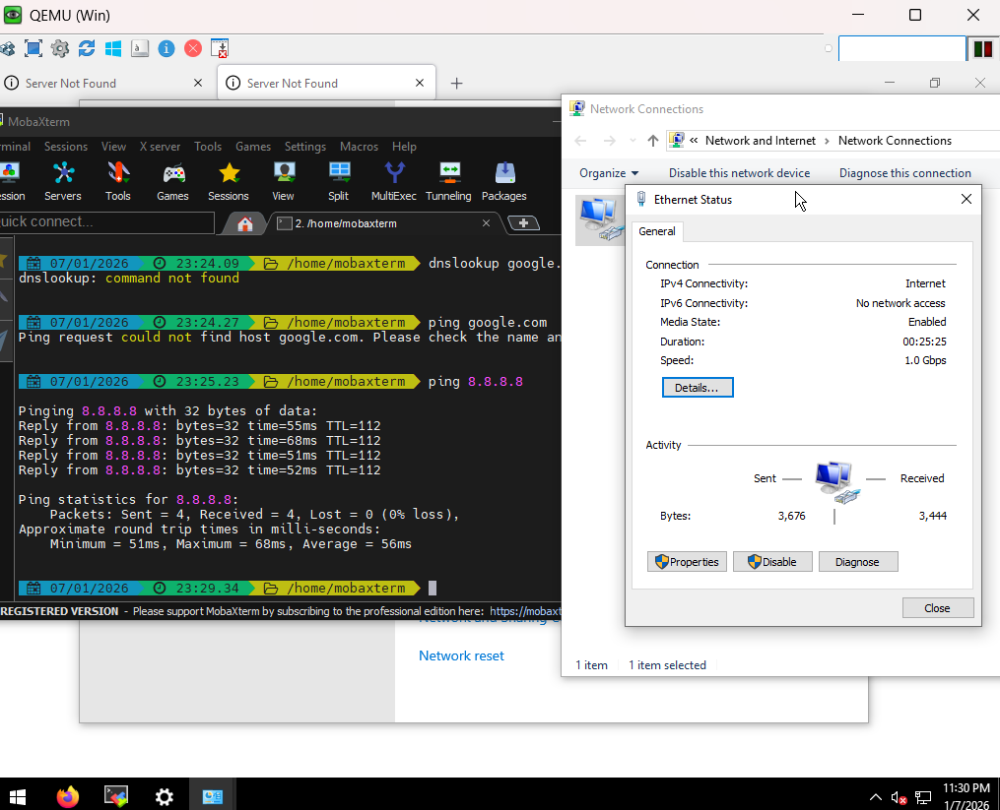
*Summarized static routing — additional verification.*

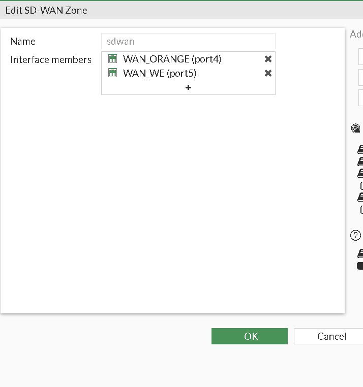
*BR1 FortiGate interface renaming (LAN_TRUNK, WAN_ORANGE, WAN_WE, HA_HB).*

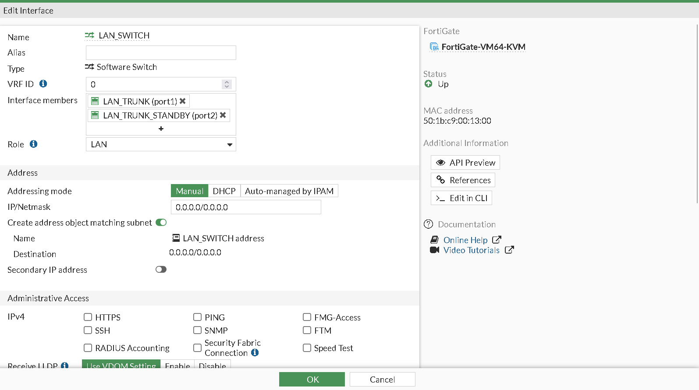
*BR1 FortiGate software switch (port1+port2) with VLAN sub-interfaces on DHCP.*

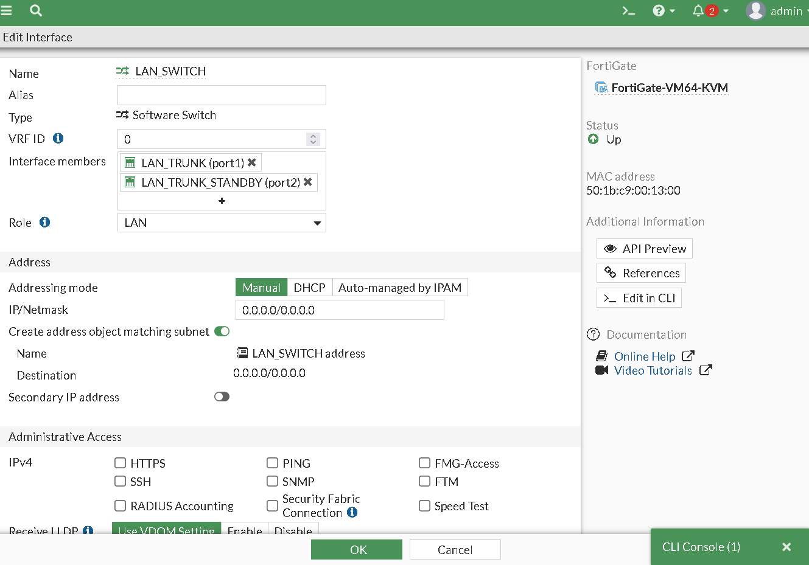
*BR1 software switch VLAN sub-interfaces.*

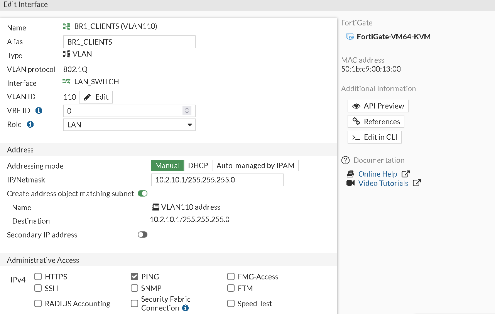
*BR1 software switch VLAN sub-interfaces.*

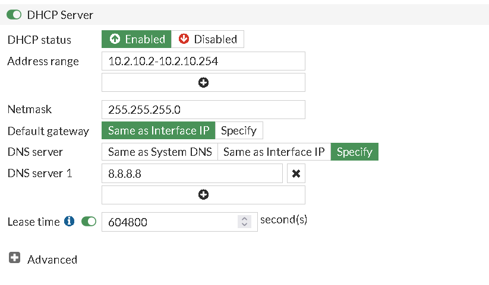
*BR1 software switch VLAN sub-interfaces.*

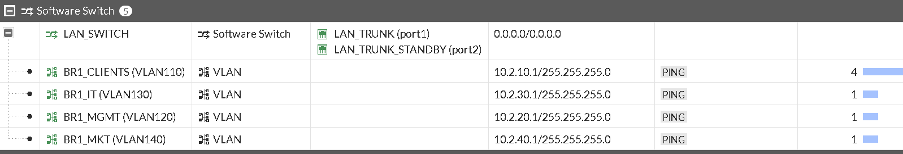
*BR1 software switch VLAN sub-interfaces.*

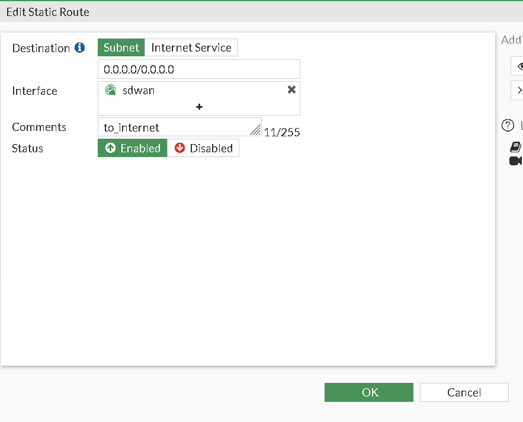
*BR1 FortiGate default route to the internet.*

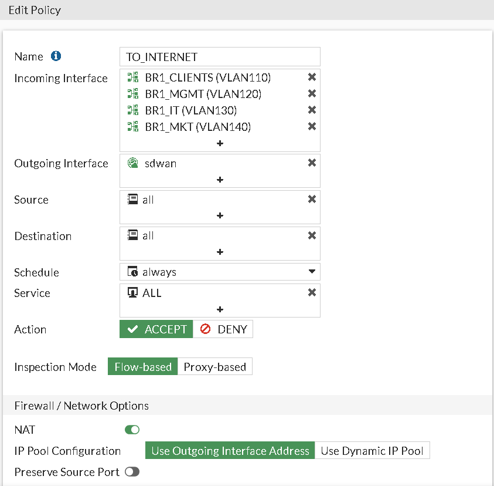
*BR1 FortiGate outbound internet policy.*


*BR2 FortiGate software switch members (port4→Core-01, port5→Core-02).*

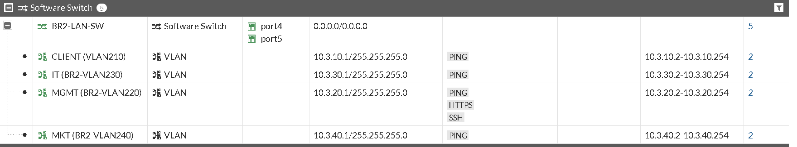
*BR2 VLAN 240 (Marketing) interface with DHCP enabled.*

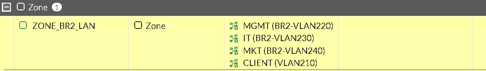
*BR2 FortiGate zone grouping all branch VLANs (ZONE_BR2_LAN).*

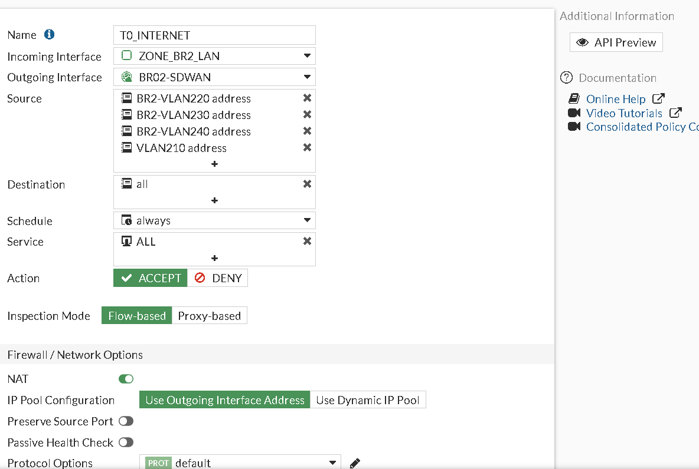
*BR2 FortiGate initial firewall policies.*

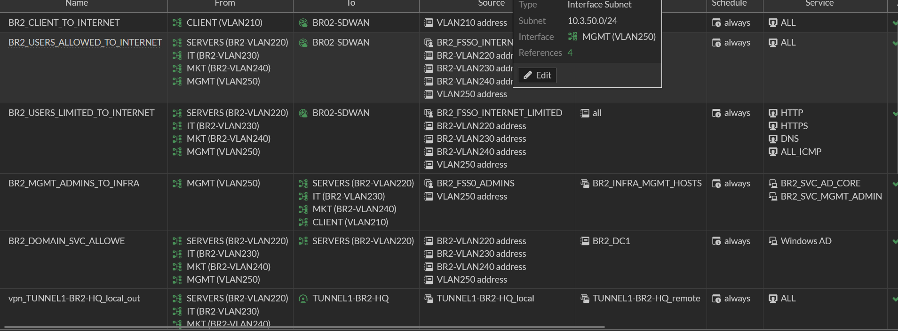
*BR2 firewall policy baseline — client internet, identity-based, admin, domain reachability.*

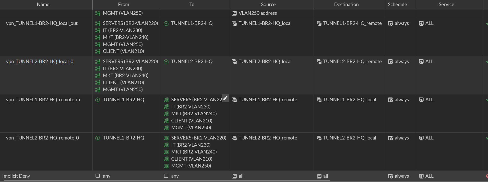
*BR2 firewall policies combining subnet-based and identity-based access.*
