# 06 — SD-WAN Implementation

## Table of Contents

1. [Overview](#1-overview)
2. [SD-WAN at HQ](#2-sd-wan-at-hq)
3. [SD-WAN at BR1](#3-sd-wan-at-br1)
4. [SD-WAN at BR2](#4-sd-wan-at-br2)
5. [Performance SLAs](#5-performance-slas)
6. [SD-WAN Rules](#6-sd-wan-rules)
7. [Verification Commands](#7-verification-commands)
---

## 1. Overview

SD-WAN (Software-Defined Wide Area Network) provides **intelligent path selection** across multiple WAN links. In the Zer0-Po!nT network, SD-WAN is deployed at all three sites (HQ, BR1, BR2) to ensure:

- **Internet redundancy** — Automatic failover between ISPs
- **Load balancing** — Distribute traffic across available links
- **Performance optimization** — Select best path based on SLA metrics
- **VPN integration** — SD-WAN manages IPSec tunnel paths

---

## 2. SD-WAN at HQ

### Configuration

```fortios
config system sdwan
    set status enable
    config zone
        edit "virtual-wan-link"
        next
    end
    config members
        edit 1
            set interface "port1"          ! WAN_ORANGE
            set zone "virtual-wan-link"
            set gateway "dhcp"
        next
        edit 2
            set interface "port2"          ! WAN_WE
            set zone "virtual-wan-link"
            set gateway "dhcp"
        next
    end
    config health-check
        edit "INTERNET_CHECK"
            set server "8.8.8.8"
            set update-cascade-interface enable
            set update-static-route enable
        next
    end
end
```

### Default Route

```fortios
config router static
    edit 3
        set dst 0.0.0.0 0.0.0.0
        set sdwan-zone "virtual-wan-link"
        set distance 5
    next
end
```

---

## 3. SD-WAN at BR1

### WAN Interfaces

| Interface | Alias | Mode | Role |
|-----------|-------|------|------|
| port4 | WAN_ORANGE | DHCP | WAN |
| port5 | WAN_WE | DHCP | WAN |

### SD-WAN Members

```fortios
config system sdwan
    config members
        edit 1
            set interface "WAN_ORANGE"
            set zone "virtual-wan-link"
        next
        edit 2
            set interface "WAN_WE"
            set zone "virtual-wan-link"
        next
    end
end
```

---

## 4. SD-WAN at BR2

### WAN Interfaces

| Interface | Alias | Mode | Role |
|-----------|-------|------|------|
| port4 | WAN_ORANGE | DHCP | WAN |
| port5 | WAN_WE | DHCP | WAN |

### SD-WAN Members

Same configuration pattern as BR1.

---

## 5. Performance SLAs

### SLA Configuration

| SLA | Server | Protocol | Port | Interval | Fail Threshold |
|-----|--------|----------|------|----------|----------------|
| INTERNET_CHECK | 8.8.8.8 | ping | — | 5s | 3 |
| TUNNEL_CHECK | Peer IP | ping | — | 5s | 3 |

### Metrics Monitored

- **Latency** — Round-trip time to target
- **Jitter** — Variation in latency
- **Packet Loss** — Percentage of lost packets

---

## 6. SD-WAN Rules

### Rule: HQ-to-Branch VPN Traffic

| Parameter | Value |
|-----------|-------|
| Name | VPN_Path_Selection |
| Source | HQ_LAN (10.1.0.0/16) |
| Destination | BR_LAN (10.2.0.0/16, 10.3.0.0/16) |
| Strategy | Best Quality |
| Quality Criteria | Latency |
| Members | All VPN interfaces |

### Rule: Internet Traffic

| Parameter | Value |
|-----------|-------|
| Name | Internet_Load_Balance |
| Source | All Internal |
| Destination | Internet |
| Strategy | Load Balance |
| Members | WAN_ORANGE, WAN_WE |

---

## 7. Verification Commands

```bash
! Verify SD-WAN status
get system sdwan

! Verify member health
get system sdwan member

! Verify health-check status
get system sdwan health-check

! Verify SD-WAN rules
get system sdwan service

! Test path quality
diagnose netlink sdwan quality-check
```

---

## Screenshots

Reference screenshots captured during the build, extracted from the original project log.

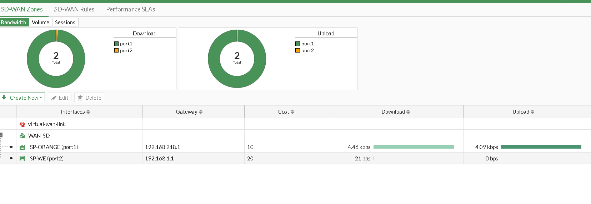
*HQ SD-WAN member/zone configuration.*

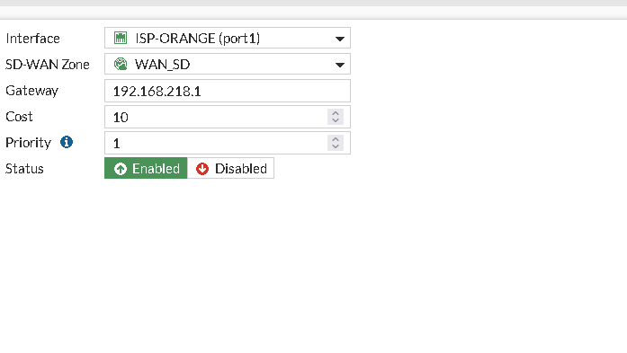
*HQ SD-WAN configuration.*

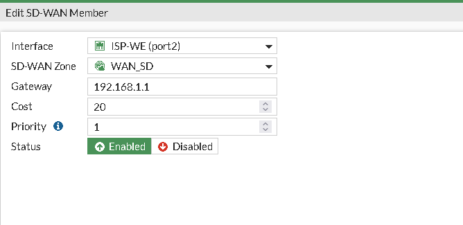
*HQ SD-WAN configuration.*

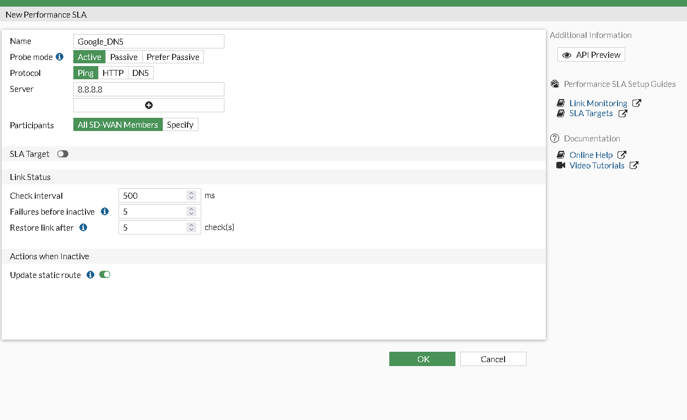
*HQ SD-WAN configuration.*

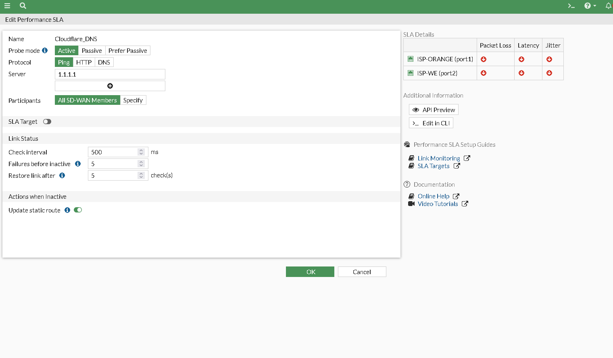
*HQ SD-WAN configuration.*

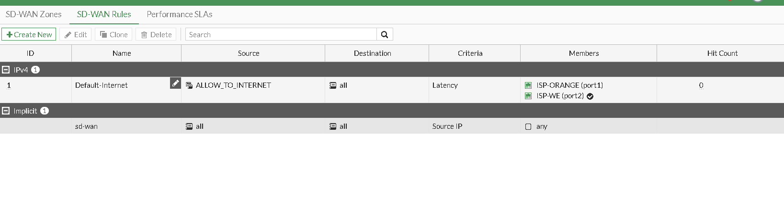
*HQ SD-WAN configuration.*

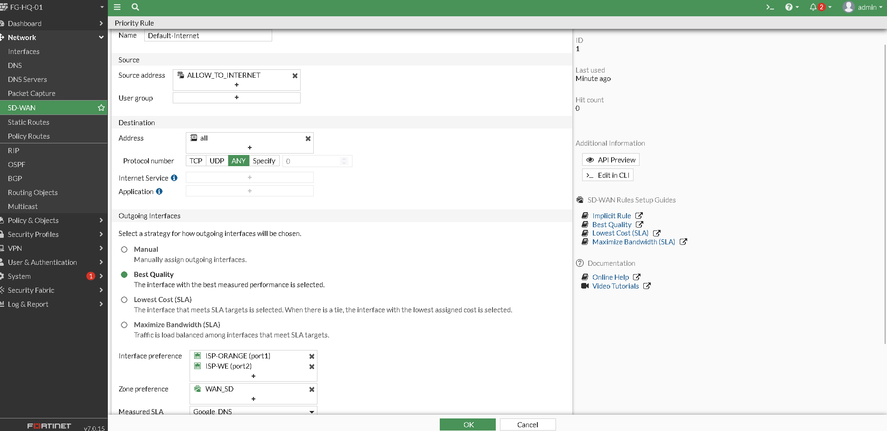
*HQ SD-WAN configuration.*

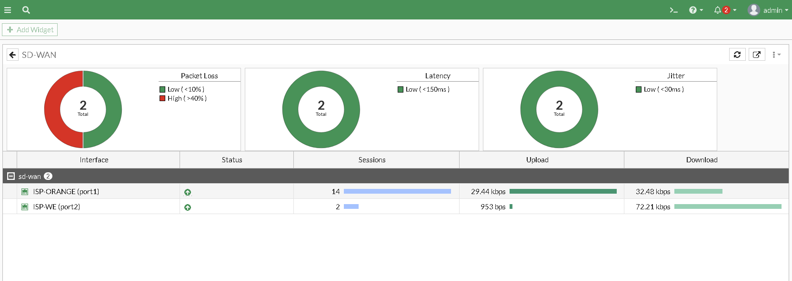
*HQ SD-WAN configuration — health-check and rule finalization.*

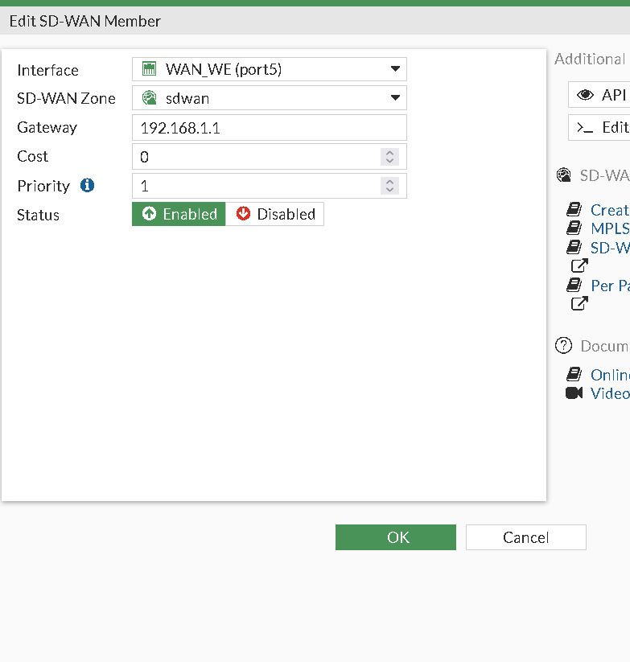
*BR1 SD-WAN member configuration.*

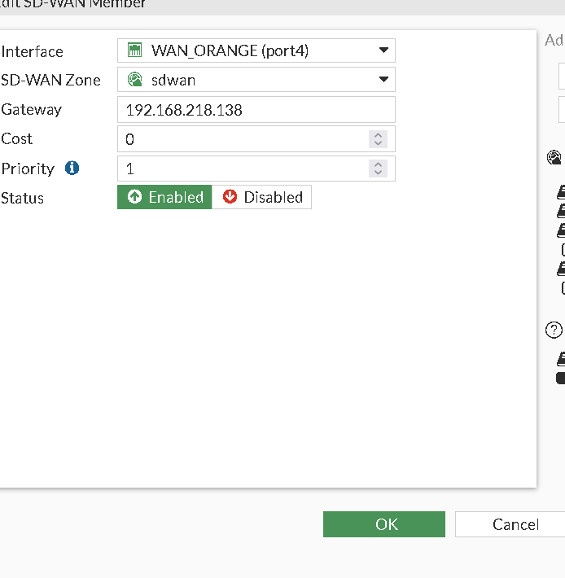
*BR1 SD-WAN configuration.*

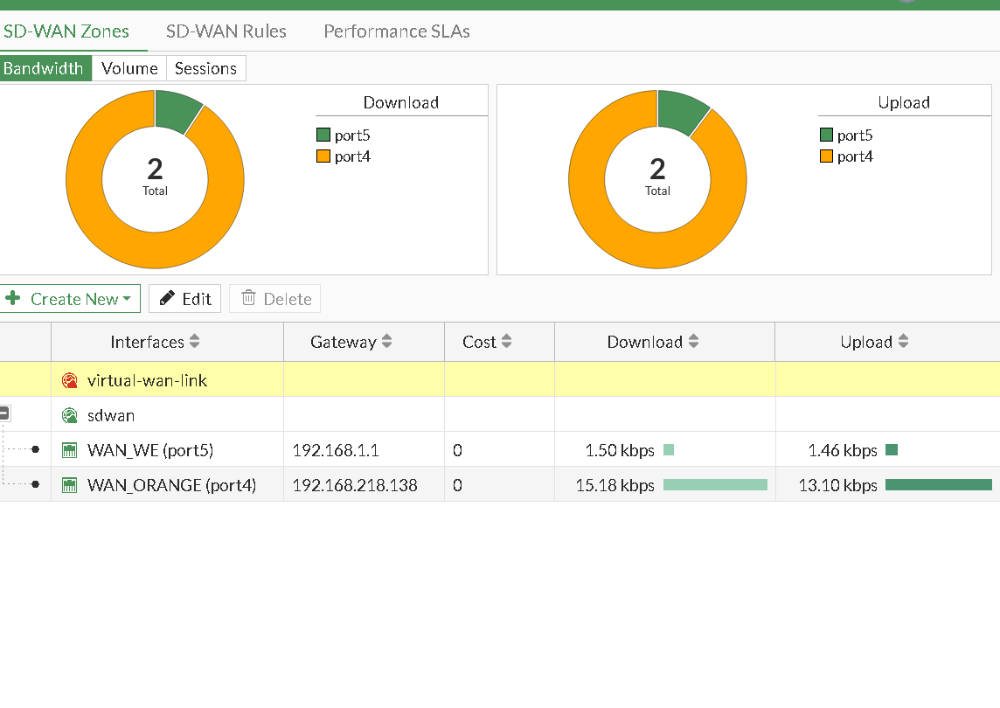
*BR1 SD-WAN configuration.*

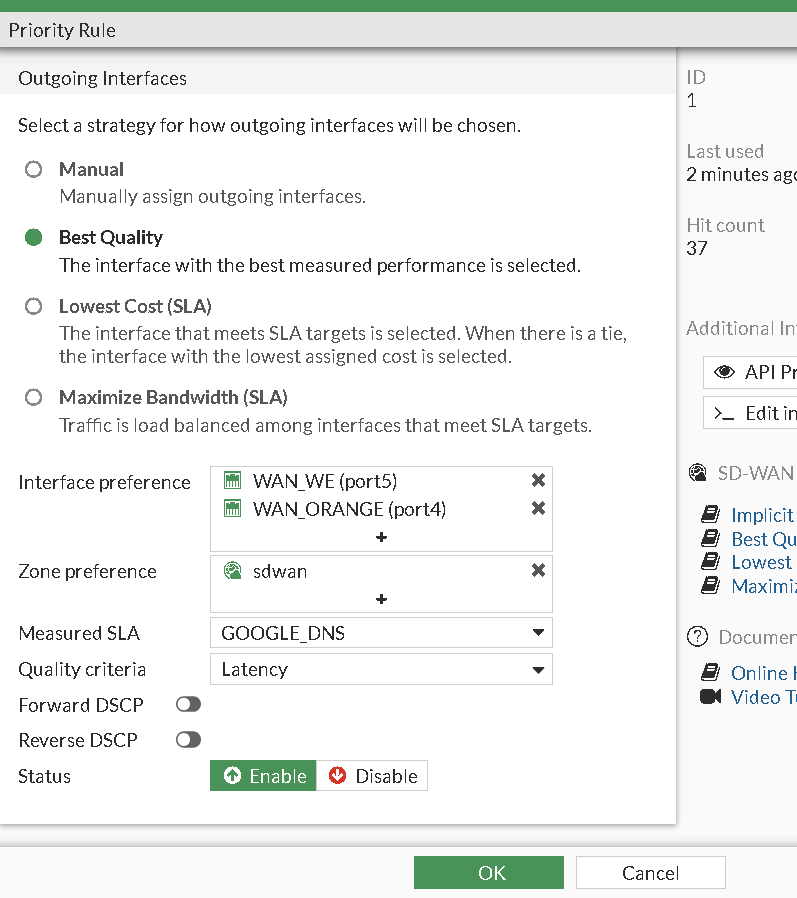
*BR1 SD-WAN configuration.*

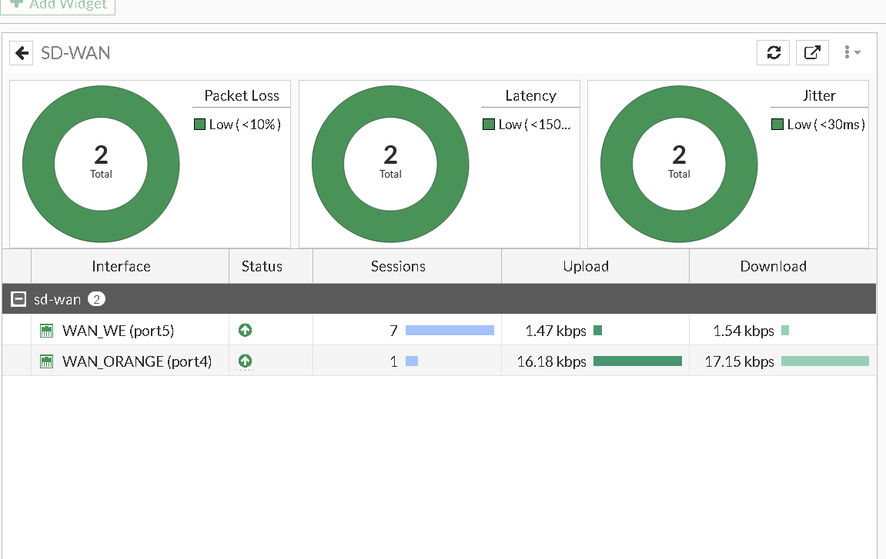
*BR1 SD-WAN configuration.*

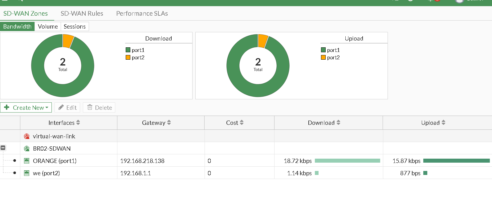
*BR2 SD-WAN configuration.*

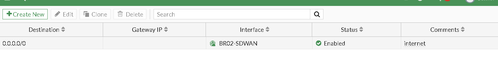
*BR2 default route pointed to the SD-WAN zone.*
