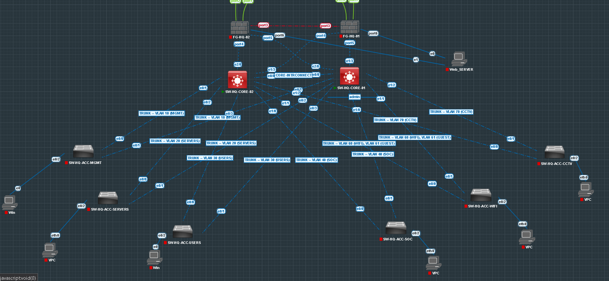
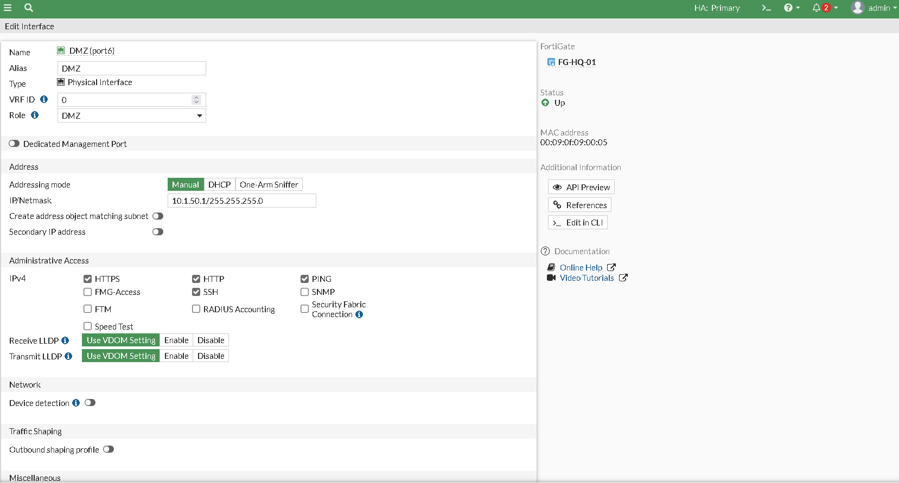
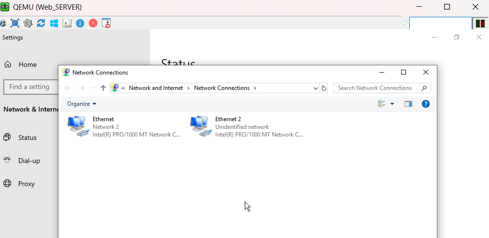
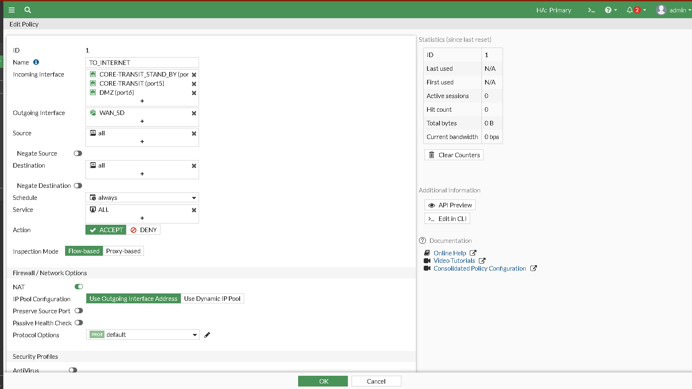
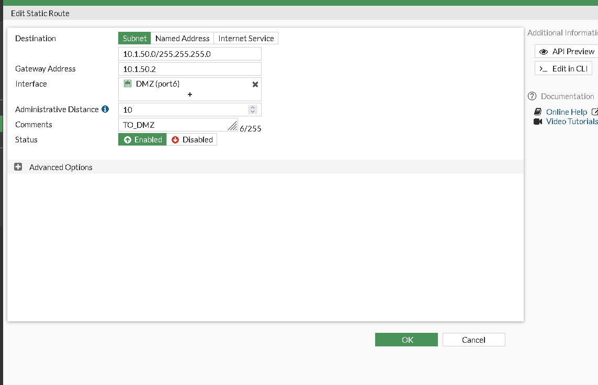
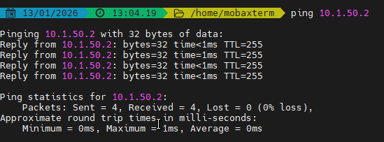
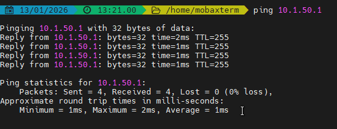
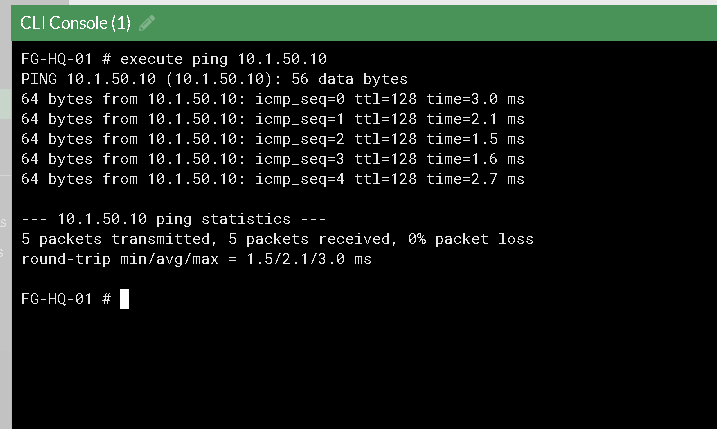
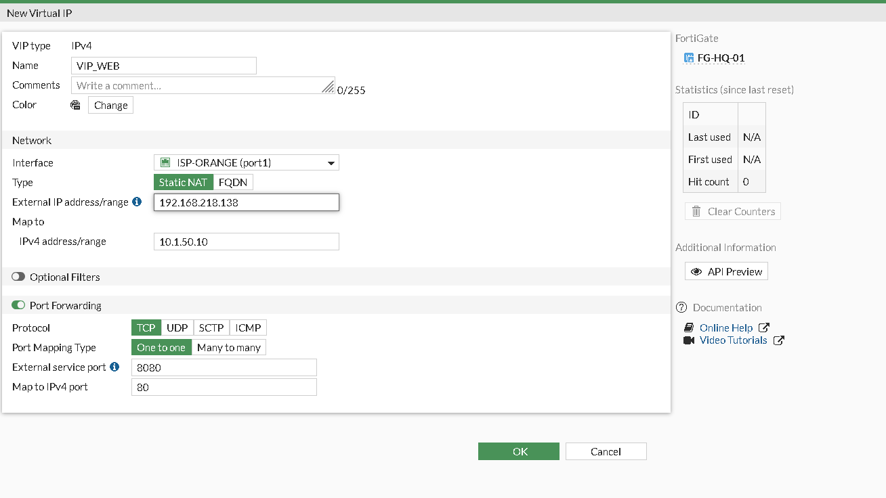
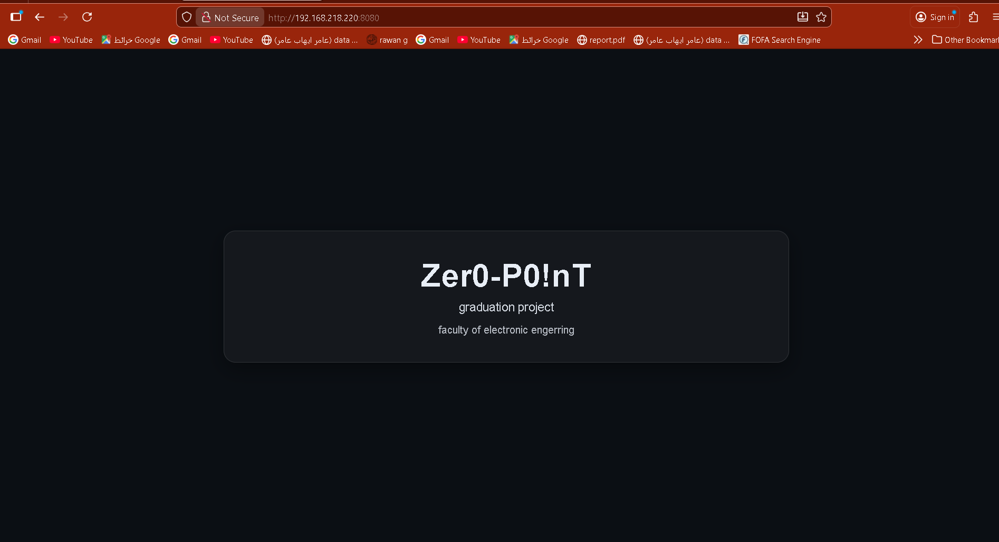

# 08 — DMZ (Demilitarized Zone)

## Table of Contents

1. [Overview](#1-overview)
2. [DMZ Design](#2-dmz-design)
3. [Core Switch Changes](#3-core-switch-changes)
4. [FortiGate DMZ Configuration](#4-fortigate-dmz-configuration)
5. [Security Profiles for DMZ](#5-security-profiles-for-dmz)
6. [NAT & Publishing](#6-nat--publishing)
7. [Verification Commands](#7-verification-commands)
---

## 1. Overview

The DMZ hosts a **public-facing web server** that must be accessible from the internet while isolated from the internal network. The FortiGate firewall controls all traffic to and from the DMZ.

---

## 2. DMZ Design

### Network

| Parameter | Value |
|-----------|-------|
| VLAN | 50 |
| Network | 10.1.50.0/24 |
| Gateway | FortiGate DMZ interface |

### Architecture

```
Internet → FortiGate → DMZ (VLAN 50) → Web Server
                ↓
            Internal LAN (blocked)
```

### Security Zones

| Zone | Trust Level | Access |
|------|-------------|--------|
| Internet | Untrusted | → DMZ only |
| DMZ | Semi-Trusted | → Internet, limited Internal |
| Internal | Trusted | → DMZ (controlled) |

---

## 3. Core Switch Changes

### Remove HSRP from VLAN 50

VLAN 50 SVIs on core switches are **shutdown** and HSRP is removed. The FortiGate becomes the sole gateway for DMZ hosts.

**On CORE-01:**
```cisco
interface vlan 50
 no standby 50
 shutdown
 no ip address
end
```

**On CORE-02:**
```cisco
interface vlan 50
 no standby 50
 shutdown
 no ip address
end
```

### DMZ Transit

The FortiGate connects to the DMZ via a dedicated interface or subinterface on the LAN trunk.

---

## 4. FortiGate DMZ Configuration

### DMZ Interface

```fortios
config system interface
    edit "DMZ"
        set vdom "root"
        set ip 10.1.50.1 255.255.255.0
        set allowaccess ping
        set role dmz
        set interface "portX"          ! Physical interface or trunk subinterface
        set vlanid 50
    next
end
```

### DMZ Zone

```fortios
config system zone
    edit "DMZ_ZONE"
        set interface "DMZ"
    next
end
```

---

## 5. Security Profiles for DMZ

### DMZ Web Publishing Policy

| Profile | Purpose | Configuration |
|-----------|---------|---------------|
| IPS | Block attacks | Block High/Critical, monitor Medium |
| App Control | Control applications | Block Proxy, P2P, Remote Access |
| AV | Scan uploads/downloads | Flow-based, quarantine enabled |
| File Filter | Control file types | Block executables, scripts, torrents |
| SSL Inspection | Certificate inspection | Validate certificates, log anomalies |

### File Filter Rules (DMZ)

| Rule | File Types | Action |
|------|-----------|--------|
| BLOCK_EXEC | Executables, Installers, Scripts | Block |
| BLOCK_TORRENT | Torrent files | Block |
| MONITOR_ARCHIVE | Archives | Monitor |
| MONITOR_DOCS | Documents | Monitor |

---

## 6. NAT & Publishing

### Virtual IP (DNAT)

```fortios
config firewall vip
    edit "WEB_SERVER_VIP"
        set extip 192.168.1.10          ! Public IP
        set extintf "WAN_ORANGE"
        set mappedip 10.1.50.10         ! DMZ Server IP
        set portforward enable
        set extport 80
        set mappedport 80
    next
end
```

### DMZ Inbound Policy

```fortios
config firewall policy
    edit 50
        set name "Internet_to_DMZ_Web"
        set srcintf "WAN_ORANGE" "WAN_WE"
        set dstintf "DMZ"
        set srcaddr "all"
        set dstaddr "WEB_SERVER_VIP"
        set action accept
        set schedule "always"
        set service "HTTP" "HTTPS"
        set logtraffic all
        set ips-sensor "DMZ_IPS"
        set av-profile "DMZ_AV"
        set application-list "DMZ_APP_CONTROL"
        set ssl-ssh-profile "DMZ_SSL_CERT"
        set file-filter-profile "DMZ_FILE_FILTER"
    next
end
```

### DMZ Outbound Policy

```fortios
config firewall policy
    edit 51
        set name "DMZ_to_Internet"
        set srcintf "DMZ"
        set dstintf "virtual-wan-link"
        set srcaddr "DMZ_NET"
        set dstaddr "all"
        set action accept
        set schedule "always"
        set service "ALL"
        set nat enable
        set logtraffic all
    next
end
```

---

## 7. Verification Commands

```bash
! Verify DMZ interface
get system interface DMZ

! Verify VIP status
get firewall vip

! Verify DMZ policies
get firewall policy

! Test DMZ server reachability
execute ping 10.1.50.10

! Verify NAT
get firewall dnathost

! Check DMZ traffic logs
execute log filter category 0
execute log filter device "DMZ"
execute log display
```

---

## Screenshots

Reference screenshots captured during the build, extracted from the original project log.


*DMZ design intro — public-facing web server isolated from internal LAN.*


*FortiGate DMZ interface/zone configuration.*


*FortiGate DMZ configuration.*


*FortiGate DMZ configuration.*


*FortiGate DMZ configuration.*


*FortiGate DMZ configuration.*


*FortiGate DMZ configuration.*


*FortiGate DMZ configuration — VIP/NAT setup.*


*FortiGate DMZ policy configuration.*


*FortiGate DMZ policy configuration — final verification.*
