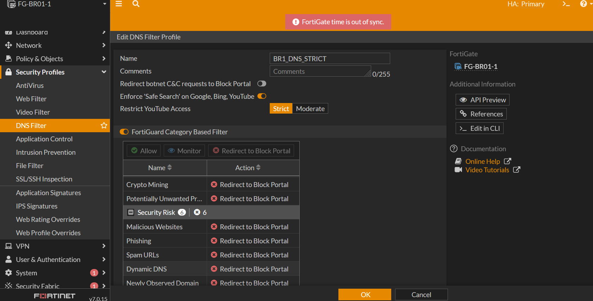
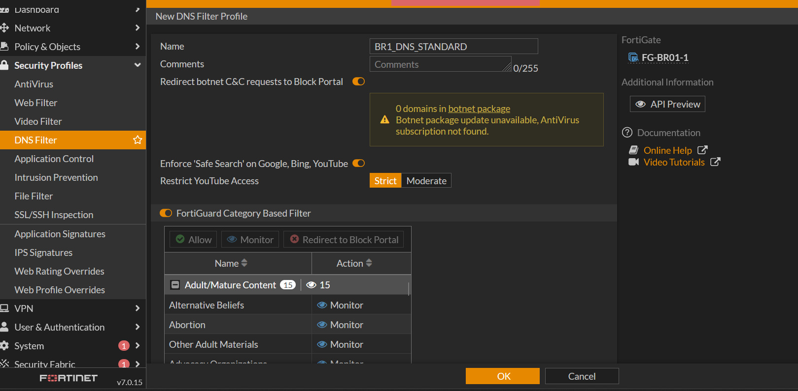
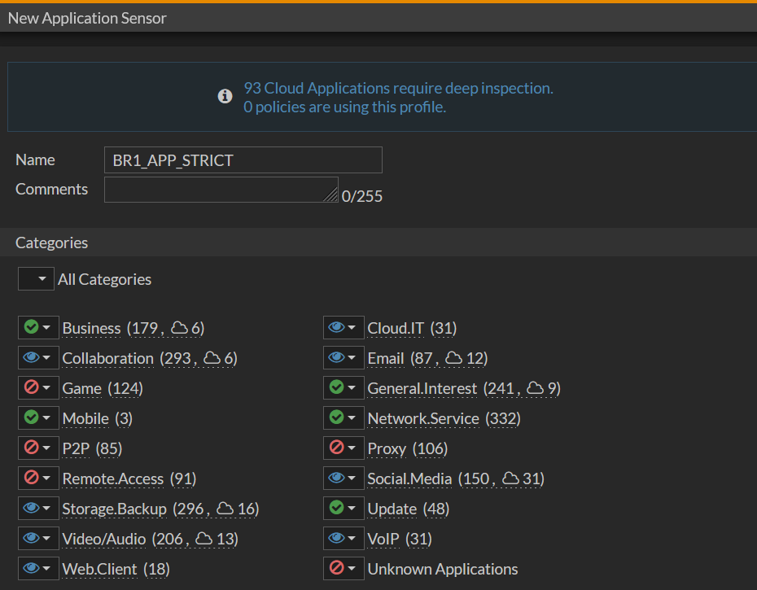
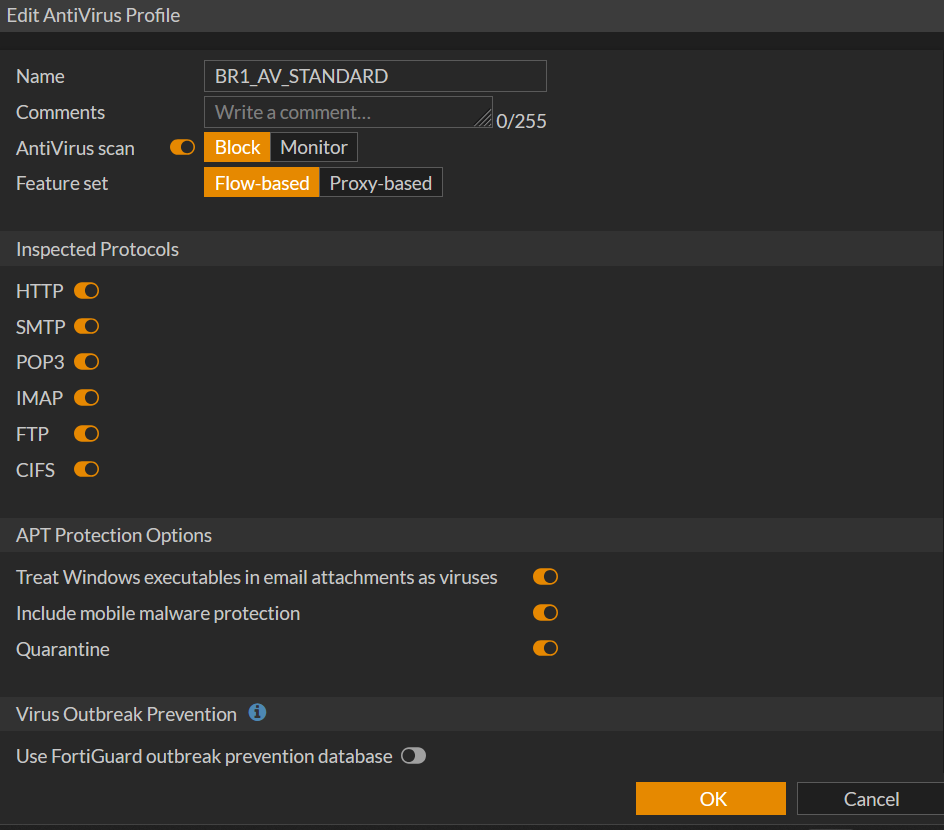
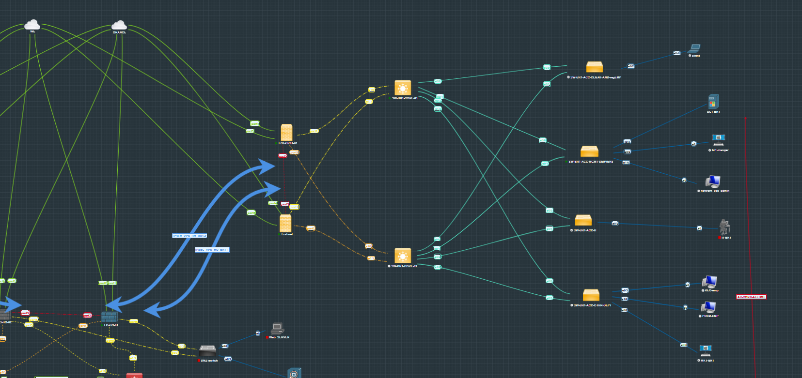

# 11 — Security Profiles

## Table of Contents

1. [Overview](#1-overview)
   - [1.1 Design Note — Consolidated HQ Policy](#11-design-note--consolidated-hq-policy)
   - [1.2 Deferred Profile — Video Filter](#12-deferred-profile--video-filter)
2. [HQ Security Profiles](#2-hq-security-profiles)
3. [BR1 Security Profiles](#3-br1-security-profiles)
4. [BR2 Security Profiles](#4-br2-security-profiles)
5. [DMZ Security Profiles](#5-dmz-security-profiles)
6. [Profile Application Matrix](#6-profile-application-matrix)
7. [Verification Commands](#7-verification-commands)
---

## 1. Overview

Security profiles provide **layered threat prevention** on FortiGate firewalls. Each profile targets a specific attack vector, and together they form a **defense-in-depth** strategy.

### Profile Types

| Profile Type | Purpose | Inspection Depth |
|-------------|---------|-----------------|
| Web Filter | Control web access | URL/category-based |
| Application Control | Regulate applications | Protocol decoding |
| IPS | Block exploits | Signature-based |
| Antivirus | Detect malware | Content scanning |
| SSL/SSH Inspection | Decrypt traffic | Certificate or full inspection |
| DNS Filter | Block malicious domains | DNS resolution layer |
| File Filter | Control file transfers | File type analysis |

---

## 1.1 Design Note — Consolidated HQ Policy

The available FortiGate license used for this project imposes a strict limit on the total number of firewall policies. Because of this, HQ does **not** split internet access into multiple role-based rules like BR1/BR2 do. Instead, a single consolidated `LAN_to_Internet` outbound policy (see [FGT-HQ-policy-internet.txt](../05-Firewall/FGT-HQ-policy-internet.txt)) carries the full security-profile stack — AV, Web Filter, App Control, IPS, SSL Inspection, DNS Filter, and File Filter — turning one rule into a centralized enforcement point. This is a deliberate license-driven design trade-off, not an oversight, and it's the reason HQ's tiering is done entirely through FSSO group matching rather than separate strict/standard/premium policies as used at the branches.

## 1.2 Deferred Profile — Video Filter

A `HQ_VIDEO_FILTER_V1` profile was scoped during the HQ hardening phase but intentionally **not deployed**. Video-category filtering was deferred until deep inspection and the associated licensing conditions are in place — it's tracked as a future enhancement (see the main [README](../README.md#-future-enhancements)) rather than shipped in this baseline.

## 2. HQ Security Profiles

### Configuration Files

| File | Profile | Description |
|------|---------|-------------|
| [HQ-web-filter.txt](HQ-web-filter.txt) | HQ_WEB_FILTER_BASELINE_V1 | Web filtering with FortiGuard + static URL |
| [HQ-app-control.txt](HQ-app-control.txt) | HQ_APP_CONTROL_BASELINE_V1 | Application control baseline |
| [HQ-ips.txt](HQ-ips.txt) | HQ_IPS_BASELINE_V1 | IPS with critical/high block |
| [HQ-av.txt](HQ-av.txt) | HQ_AV_BASELINE_V1 | Flow-based antivirus |
| [HQ-ssl-inspection.txt](HQ-ssl-inspection.txt) | HQ_SSL_CERT_BASELINE_V1 | Certificate inspection mode |
| [HQ-dns-filter.txt](HQ-dns-filter.txt) | HQ_DNS_FILTER_BASELINE_V1 | DNS filtering with Safe Search |
| [HQ-file-filter.txt](HQ-file-filter.txt) | HQ_FILE_FILTER_BASELINE_V1 | File type filtering |

---

## 3. BR1 Security Profiles

### Tiered Profile Model

BR1 uses a **tiered approach** based on user role and internet access level.

### Configuration Files

| File | Profile | Tier | Applied To |
|------|---------|------|-----------|
| [BR1-dns-strict.txt](BR1-dns-strict.txt) | BR1_DNS_STRICT | Strict | General clients, limited internet |
| [BR1-dns-standard.txt](BR1-dns-standard.txt) | BR1_DNS_STANDARD | Standard | Controlled internet users |
| [BR1-dns-premium.txt](BR1-dns-premium.txt) | BR1_DNS_PREMIUM | Premium | Management |
| [BR1-web-strict.txt](BR1-web-strict.txt) | BR1_WEB_STRICT | Strict | General clients, limited internet |
| [BR1-web-standard.txt](BR1-web-standard.txt) | BR1_WEB_STANDARD | Standard | Controlled internet users |
| [BR1-web-premium.txt](BR1-web-premium.txt) | BR1_WEB_PREMIUM | Premium | Management |
| [BR1-app-strict.txt](BR1-app-strict.txt) | BR1_APP_STRICT | Strict | General clients |
| [BR1-app-standard.txt](BR1-app-standard.txt) | BR1_APP_STANDARD | Standard | Controlled users |
| [BR1-app-premium.txt](BR1-app-premium.txt) | BR1_APP_PREMIUM | Premium | Management |
| [BR1-ips-strict.txt](BR1-ips-strict.txt) | BR1_IPS_STRICT | Strict | Client traffic |
| [BR1-ips-standard.txt](BR1-ips-standard.txt) | BR1_IPS_STANDARD | Standard | Controlled users |
| [BR1-ips-premium.txt](BR1-ips-premium.txt) | BR1_IPS_PREMIUM | Premium | Management |
| [BR1-av.txt](BR1-av.txt) | BR1_AV_STANDARD | — | All outbound policies |
| [BR1-file-filter.txt](BR1-file-filter.txt) | BR1_FILE_FILTER | — | All outbound policies |

---

## 4. BR2 Security Profiles

### Configuration Files

| File | Profile | Tier | Applied To |
|------|---------|------|-----------|
| [BR2-dns-strict.txt](BR2-dns-strict.txt) | BR2_DNS_STRICT | Strict | General clients |
| [BR2-dns-standard.txt](BR2-dns-standard.txt) | BR2_DNS_STANDARD | Standard | Controlled users |
| [BR2-dns-premium.txt](BR2-dns-premium.txt) | BR2_DNS_PREMIUM | Premium | Management |
| [BR2-web-strict.txt](BR2-web-strict.txt) | BR2_WEB_STRICT | Strict | General clients |
| [BR2-web-standard.txt](BR2-web-standard.txt) | BR2_WEB_STANDARD | Standard | Controlled users |
| [BR2-web-premium.txt](BR2-web-premium.txt) | BR2_WEB_PREMIUM | Premium | Management |
| [BR2-app-strict.txt](BR2-app-strict.txt) | BR2_APP_STRICT | Strict | General clients |
| [BR2-app-standard.txt](BR2-app-standard.txt) | BR2_APP_STANDARD | Standard | Controlled users |
| [BR2-app-premium.txt](BR2-app-premium.txt) | BR2_APP_PREMIUM | Premium | Management |
| [BR2-ips-strict.txt](BR2-ips-strict.txt) | BR2_IPS_STRICT | Strict | Client traffic |
| [BR2-ips-standard.txt](BR2-ips-standard.txt) | BR2_IPS_STANDARD | Standard | Controlled users |
| [BR2-ips-premium.txt](BR2-ips-premium.txt) | BR2_IPS_PREMIUM | Premium | Management |
| [BR2-av.txt](BR2-av.txt) | BR2_AV_STANDARD | — | All outbound policies |
| [BR2-file-filter.txt](BR2-file-filter.txt) | BR2_FILE_FILTER | — | All outbound policies |

---

## 5. DMZ Security Profiles

### DMZ-Specific Design

The DMZ uses **stricter controls** than internal networks because it hosts a public-facing web server.

### Configuration Files

| File | Profile | Description |
|------|---------|-------------|
| [DMZ-ips.txt](DMZ-ips.txt) | DMZ_IPS | IPS focused on web attacks |
| [DMZ-app-control.txt](DMZ-app-control.txt) | DMZ_APP_CONTROL | Block non-web applications |
| [DMZ-av.txt](DMZ-av.txt) | DMZ_AV | Full scanning for uploads/downloads |
| [DMZ-file-filter.txt](DMZ-file-filter.txt) | DMZ_FILE_FILTER | Block executables, scripts, OS images |

---

## 6. Profile Application Matrix

### HQ Policy Application

| Policy | AV | Web Filter | App Control | IPS | SSL | DNS | File Filter |
|--------|-----|-----------|-------------|-----|-----|-----|-------------|
| LAN_to_Internet | HQ_AV | HQ_WEB | HQ_APP | HQ_IPS | HQ_SSL | HQ_DNS | HQ_FILE |
| DMZ_Inbound | DMZ_AV | — | DMZ_APP | DMZ_IPS | DMZ_SSL | — | DMZ_FILE |
| DMZ_Outbound | DMZ_AV | — | DMZ_APP | DMZ_IPS | DMZ_SSL | — | DMZ_FILE |

### BR1 Policy Application

| Policy | AV | Web Filter | App Control | IPS | SSL | DNS | File Filter |
|--------|-----|-----------|-------------|-----|-----|-----|-------------|
| Client_Internet | BR1_AV_STANDARD | BR1_WEB_STRICT | BR1_APP_STRICT | BR1_IPS_STRICT | cert-inspect | BR1_DNS_STRICT | BR1_FILE_FILTER |
| Controlled_Internet | BR1_AV_STANDARD | BR1_WEB_STANDARD | BR1_APP_STANDARD | BR1_IPS_STANDARD | cert-inspect | BR1_DNS_STANDARD | BR1_FILE_FILTER |
| Management_Internet | BR1_AV_STANDARD | BR1_WEB_PREMIUM | BR1_APP_PREMIUM | BR1_IPS_PREMIUM | cert-inspect | BR1_DNS_PREMIUM | BR1_FILE_FILTER |

### BR2 Policy Application

Same pattern as BR1 with BR2-prefixed profiles.

---

## 7. Verification Commands

```bash
! Verify security profiles
get security-profile av
get security-profile webfilter
get security-profile application-list
get security-profile ips
get security-profile ssl-ssh-profile
get security-profile dnsfilter
get security-profile file-filter

! Verify policy with profiles
get firewall policy

! Test web filter
diagnose test urlfilter <URL>

! Test application control
diagnose test application <app_name>

! View security logs
diagnose log filter category 0
diagnose log filter field policy_id <id>
diagnose log display
```

---

## Screenshots

Reference screenshots captured during the build, extracted from the original project log.


*BR1_DNS_STRICT — strict DNS filtering profile for general/limited-internet clients.*


*BR1_DNS_STANDARD — standard DNS filtering profile for controlled internet users.*


*BR1_APP_STRICT — strict application control profile.*


*BR1_AV_STANDARD — antivirus inspection profile for BR1 outbound traffic.*


*BR1_FILE_FILTER — unified file filtering profile for BR1 outbound traffic.*
