# 12 — High Availability & Redundancy

## Table of Contents

1. [Overview](#1-overview)
2. [Core Layer HA](#2-core-layer-ha)
3. [Firewall HA](#3-firewall-ha)
4. [ISP Redundancy](#4-isp-redundancy)
5. [VPN Redundancy](#5-vpn-redundancy)
6. [AD Redundancy](#6-ad-redundancy)
7. [Failover Testing](#7-failover-testing)
8. [Redundancy Summary](#8-redundancy-summary)
---

## 1. Overview

The Zer0-Po!nT network is designed with **no single point of failure** at every layer. Redundancy is implemented across:

- Core switches (HSRP)
- Firewalls (FortiGate HA)
- ISPs (Dual WAN with SD-WAN)
- VPN tunnels (Dual IPSec over dual ISPs)
- Domain Controllers (Primary + Secondary)

---

## 2. Core Layer HA

### HSRP (Hot Standby Router Protocol)

| Parameter | Core-01 | Core-02 |
|-----------|---------|---------|
| Role | Active | Standby |
| HSRP Priority | 110 | 100 |
| Preempt | Enabled | Enabled |
| Virtual IP | 10.1.X.1 | 10.1.X.1 |
| Physical IP | 10.1.X.2 | 10.1.X.3 |

### Failover Behavior

1. **Normal Operation:** Core-01 handles all gateway traffic
2. **Core-01 Failure:** Core-02 takes over as Active gateway
3. **Core-01 Recovery:** Preempts back to Active role

### STP Redundancy

| Parameter | Core-01 | Core-02 |
|-----------|---------|---------|
| STP Role | Root Primary | Root Secondary |
| Forwarding Path | Preferred | Backup |

---

## 3. Firewall HA

### FortiGate HA Configuration

| Parameter | FG-HQ-01 | FG-HQ-02 |
|-----------|----------|----------|
| Mode | Active/Passive | Active/Passive |
| Priority | 200 | 100 |
| Heartbeat | port3 | port3 |
| Monitored Interfaces | port1, port2, port4, port5 | port1, port2, port4, port5 |

### Failover Behavior

1. **Normal Operation:** FG-HQ-01 is Active, FG-HQ-02 is Passive
2. **FG-HQ-01 Failure:** FG-HQ-02 becomes Active automatically
3. **Floating IPs:** 10.1.99.1 and 10.1.98.1 move to the new Active unit
4. **Configuration Sync:** Automatic via HA heartbeat

### HA Verification

```bash
get system ha status
```

### Testing HA Failover

1. Power off FG-HQ-01 (Active)
2. Wait for FG-HQ-02 to become Primary
3. Verify from Core-01: `ping 10.1.99.1`
4. Verify from Core-02: `ping 10.1.98.1`
5. Verify from FortiGate: `execute ping 8.8.8.8`

---

## 4. ISP Redundancy

### SD-WAN with Dual ISPs

| ISP | Interface | Role | Health Check |
|-----|-----------|------|-------------|
| ORANGE | port1 | Primary/Load Balance | 8.8.8.8 |
| WE | port2 | Primary/Load Balance | 8.8.8.8 |

### Failover Behavior

- If one ISP fails → Traffic shifts to the other ISP automatically
- SD-WAN health checks monitor both links continuously
- Default route points to SD-WAN zone (not a single interface)

---

## 5. VPN Redundancy

### Dual IPSec Tunnels

| Tunnel | Path | Distance | Role |
|--------|------|----------|------|
| Tunnel 1 | ORANGE ↔ ORANGE | 10 | Primary |
| Tunnel 2 | WE ↔ WE | 20 | Backup |

### Failover Behavior

1. **Normal:** Traffic uses Tunnel 1 (lower distance)
2. **Tunnel 1 Failure:** Traffic shifts to Tunnel 2
3. **SD-WAN Integration:** Health checks monitor tunnel availability

---

## 6. AD Redundancy

### Domain Controller Redundancy

| Site | Primary DC | Secondary DC | Replication |
|------|-----------|-------------|-------------|
| HQ | DC1-HQ | DC2-HQ | Automatic |
| BR1 | DC1-BR1 | — | From HQ |
| BR2 | DC1-BR2 | — | From HQ |

### Global Catalog

Both DC1-HQ and DC2-HQ are configured as **Global Catalog servers** for fast directory queries.

### Replication Verification

```powershell
repadmin /replsummary
repadmin /showrepl
```

---

## 7. Failover Testing

### Test Matrix

| Test | Component | Expected Result | Status |
|------|-----------|----------------|--------|
| Core-01 Failure | HSRP | Core-02 becomes Active | ✅ |
| Core-02 Failure | HSRP | Core-01 remains Active | ✅ |
| FG-HQ-01 Failure | FortiGate HA | FG-HQ-02 becomes Active | ✅ |
| ISP-ORANGE Failure | SD-WAN | Traffic via ISP-WE | ✅ |
| Tunnel 1 Failure | IPSec | Traffic via Tunnel 2 | ✅ |
| DC1-HQ Failure | AD | DC2-HQ handles queries | ✅ |

### Core-01 Failure Test

```bash
# On Core-01
shutdown                    ! Simulate failure

# On Core-02
show standby brief          ! Verify Active role
show ip route               ! Verify routing

# From client
ping 10.1.30.1             ! Verify gateway reachability
traceroute 8.8.8.8          ! Verify path through Core-02
```

### FortiGate HA Test

```bash
# Power off FG-HQ-01
# On FG-HQ-02
get system ha status        ! Verify "Primary" role

# From Core-01
ping 10.1.99.1             ! Verify floating IP moved

# From FortiGate CLI
execute ping 8.8.8.8        ! Verify internet access
```

---

## 8. Redundancy Summary

| Layer | Technology | Failover Time | Impact |
|-------|-----------|---------------|--------|
| Core | HSRP | < 3 seconds | Seamless |
| Firewall | FortiGate HA | < 10 seconds | Minimal |
| ISP | SD-WAN | < 5 seconds | Automatic |
| VPN | Dual IPSec | < 10 seconds | Automatic |
| AD | DC Replication | < 30 seconds | Transparent |

### No Single Point of Failure Checklist

- [x] Dual Core Switches
- [x] Dual Firewalls (HA)
- [x] Dual ISPs
- [x] Dual VPN Tunnels per branch
- [x] Dual Domain Controllers (HQ)
- [x] Dual Uplinks per Access Switch
- [x] Dual VPN Paths (ORANGE + WE)

> **Result:** The Zer0-Po!nT network (HQ, BR1, BR2) has **zero single points of failure**.

---

## Screenshots

Reference screenshots captured during the build, extracted from the original project log.

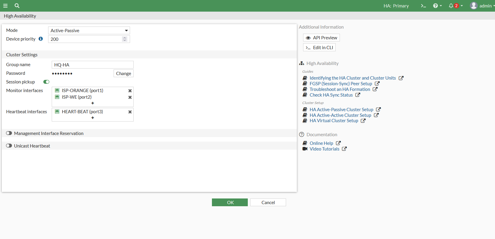
*HQ FortiGate HA — next phase after SD-WAN/internet routing.*

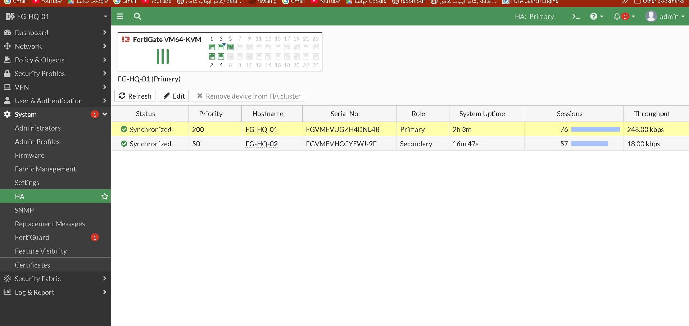
*HQ FortiGate HA configuration.*

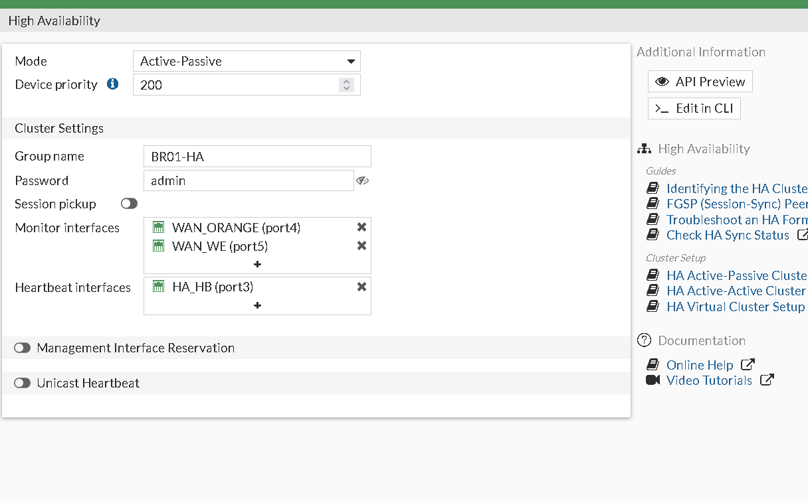
*BR1 FortiGate HA — group settings on the primary unit.*

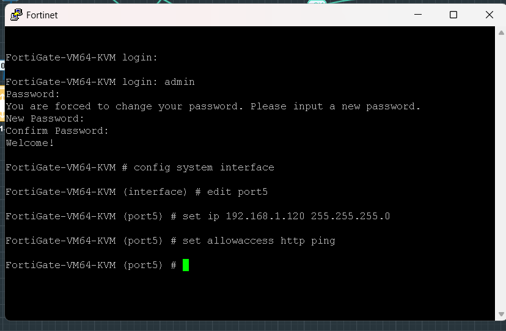
*BR1 FortiGate HA configuration.*

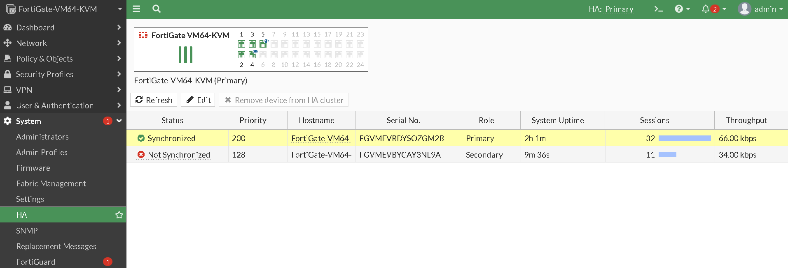
*BR1 secondary FortiGate (FGT-02) initialization.*

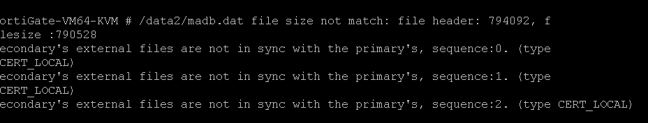
*BR1 HA cluster waiting to sync.*


*BR1 HA cluster waiting to sync.*

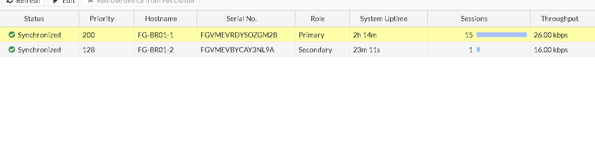
*BR1 HA cluster synced successfully.*

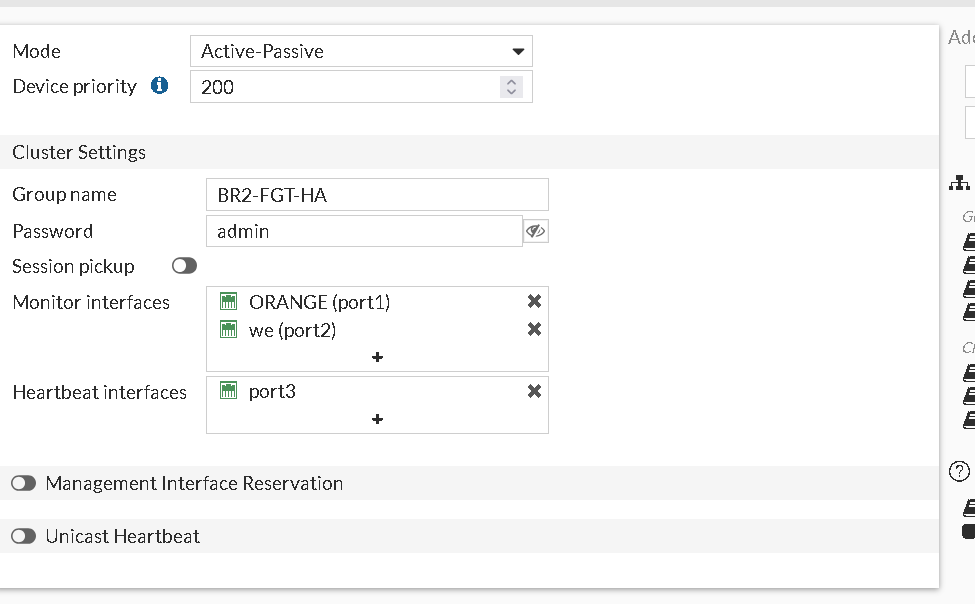
*BR2 FortiGate HA — group settings, heartbeat, monitored interfaces.*

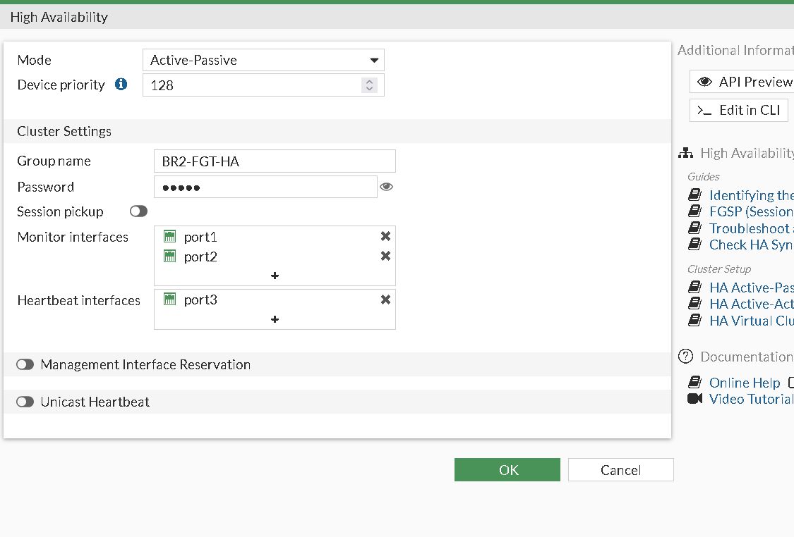
*BR2 FortiGate HA configuration.*

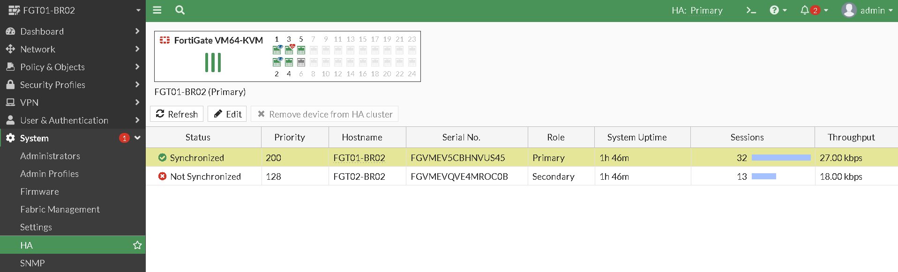
*BR2 FortiGate HA configuration.*

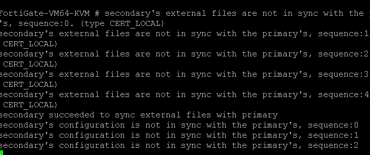
*BR2 HA cluster waiting to sync.*

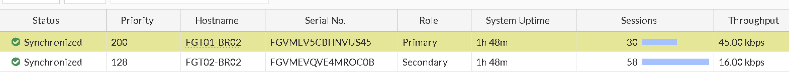
*BR2 HA cluster waiting to sync.*

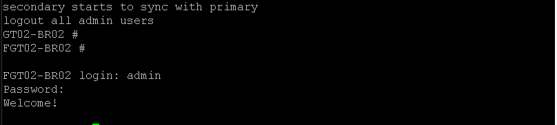
*BR2 HA cluster waiting to sync — cluster complete.*
